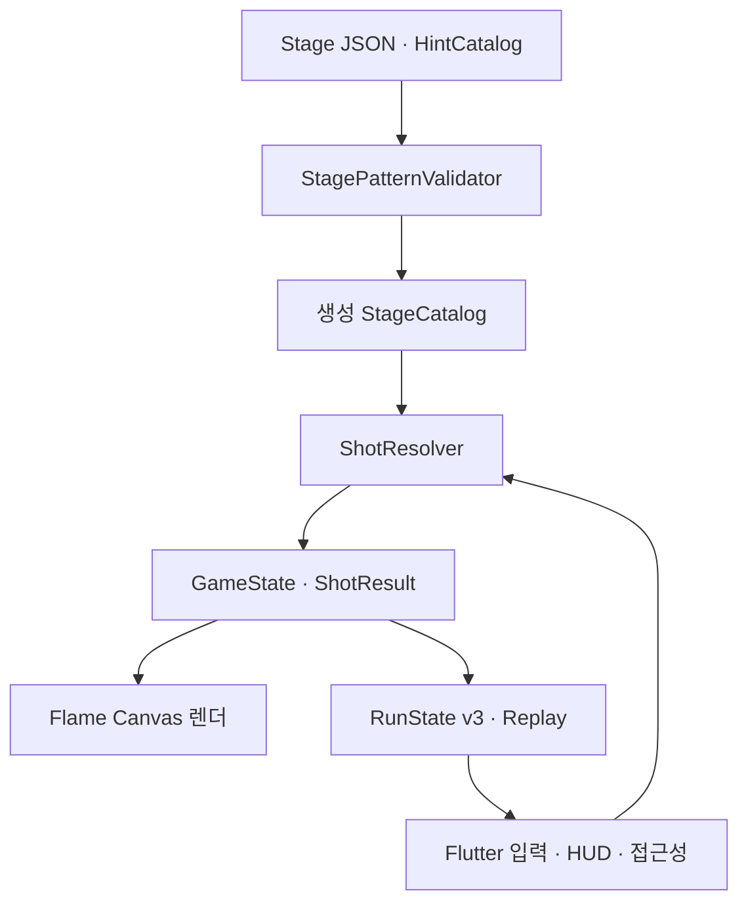

# 속성 한방 (Property Shot)

환경 오브젝트의 물리 속성을 공으로 옮기고, 바뀐 장면과 실패한 공까지 다음 해법으로 사용하는 세로형 물리 퍼즐입니다. Flutter와 Flame으로 제작한 NAN 2026 Game × AI 해커톤 수직 프로토타입입니다.

[웹에서 플레이하기](https://good5229.github.io/Property_shot/)


## 게임의 핵심

일반적인 조준 퍼즐은 방향과 힘을 맞추면 한 번의 시도가 끝납니다. 속성 한방에서는 샷이 끝난 뒤에도 장면이 남습니다.

- 돌의 **무거움**, 젤리의 **탄성**, 점착판의 **점착**, 가시의 **뾰족함**을 공에 옮깁니다.
- 속성을 잃은 원본 오브젝트도 질량·재질·이동성이 달라집니다.
- 빗나간 공, 열린 문, 눌린 스위치, 회전한 반사판이 다음 샷의 기물이 됩니다.
- 짧은 클리어와 기믹을 연결한 고득점 경로를 함께 허용하되, 모든 단계에서 기믹 활용이 더 유리하도록 검증합니다.

```text
관찰 → 속성 선택 → 방향·힘 결정 → 물리 연쇄 → 바뀐 상태 재사용
```

## 플레이 방법

1. 보드의 물체를 눌러 속성과 역할을 확인합니다.
2. `옮기기`를 선택해 물체의 속성을 공에 장착합니다.
3. 공에서 바깥쪽으로 드래그해 방향을 정합니다.
4. 공을 길게 눌러 힘을 모으고 손을 떼어 발사합니다.
5. 현재 공이나 이전에 남은 공을 홀에 넣으면 스테이지를 클리어합니다.

쉬움 모드는 실제 `ShotResolver` 결과를 이용해 첫 도착 예상점을 표시합니다. 보통 모드는 경로를 숨기고 현재 조준 표시만 제공합니다. 충전 게이지는 공 가까이에 나타나며 홀·기믹·힌트 열쇠를 피해 배치되고, 오른손·왼손 선호를 지원합니다.

## 현재 구현 범위

### 10단계 × 4패턴

| 단계 | 배우는 규칙 |
|---|---|
| 1. 무거움 | 무거운 공으로 상자와 기물을 밀기 |
| 2. 탄성 | 벽과 젤리 반사를 이용해 방향 바꾸기 |
| 3. 연쇄 문 | 스위치·문·점착판의 인과 연결 |
| 4. 풍선 | 뾰족함으로 풍선을 터뜨려 숨은 스위치 열기 |
| 5. 비워진 속성 | 공이 얻은 속성과 원본이 잃은 속성을 함께 활용 |
| 6. 파워 발판 | 감속한 공을 재가속해 다음 구간 통과 |
| 7. 잔류 공 | 첫 공을 다음 샷의 쿠션·스위치·스토퍼로 사용 |
| 8. 연쇄 점수 | 벽·기물·과거 공을 연결해 고득점 만들기 |
| 9. 회전 반사판 | 반사판의 현재 방향과 회전 후 방향을 두 샷에 걸쳐 활용 |
| 10. 속성 통합 | 이전 단계의 속성·문·발판·잔류 공을 복합적으로 사용 |

각 단계는 같은 규칙을 다른 공간에서 다시 적용하는 4개 패턴을 가집니다. 캠페인의 첫 학습 구간은 읽기 쉬운 기준 패턴을 먼저 보여 주고, 이후에는 셔플 백이 4개 패턴을 균등하게 노출합니다.

### 플레이 지원

- 캠페인 저장과 분리된 `60초 핵심 체험`: 무거움 이전 → 비워진 원본 → 남은 공 재사용의 세 장면을 실제 생산 패턴으로 연속 플레이
- 속성 이전 직후 원본의 `보유 → 비움`과 공의 `기본 → 획득`, 원본의 실제 물리 변화를 함께 알리는 양면 변화 리본과 잃은 속성 표식
- 초행·첫 클리어·3단계 학습 상태에 따라 보상·리플레이·오늘의 도전을 필요한 시점에만 여는 점진적 홈 메뉴
- 스테이지별 `발견 0/3` 관측 임무와 물리 인과 기록
- 발견 도감과 누적 발견에 따른 관측소·등대·다리 복구
- 발견 6·12·18개에서 시설이 성장해 4주 실험 기록·추천 이유·기기 내 기록 비교 해금
- 정밀 조작 도움에서 예상 첫 도착과 5도·한 칸 단위 각도/힘 버튼 제공(경쟁 기록 분리)
- 주간 실험은 KST 월요일 0시에 교체되며 속성·반사·인과·자유 응용별 실제 시나리오 풀 사용
- 복구 시설 하나를 집중 지원으로 선택해 정밀 충전·L2 팁·추가 복사 코어 중 한 효과 강화
- 실패해도 이번 시도에서 발견한 사건을 보여 주는 결과 요약
- 실패 화면의 `다음 실험` 목표와 직전 조준 비교선
- 두 번 이상 막혔을 때만 나타나는 선택형 도움 추천
- 현재 패턴의 첫 실패 후 즉시 열리는 선택형 L1 힌트
- 40개 패턴별 L1/L2 힌트와 선택형 힌트 열쇠
- 다음 스테이지 팁을 포함한 10종 런 보상과 실험 확장·안전망·숙련 역할별 후보
- 선택한 보상의 사용 시점·남은 상태를 확인하는 `내 런 보상` 메뉴
- 청록 그라데이션·금색 외곽선 공 꾸미기
- 쉬움/보통 난이도와 기록 귀속 분리
- 실패 충돌 순서와 기믹 인과 안내
- 되감기·초기화·일시정지
- 단계별 최고 기록과 창의 연쇄 점수
- 패턴별 해법 도장, 다른 해법 재도전, 직전 성공 조준 비교와 체크섬 해법 카드
- 일반 런과 오늘의 도전
- 발견·정밀·연쇄·창의 3단계 탐사와 체크섬 기반 탐사 공유 코드
- 자동 리플레이 저장·재생·공유 코드 가져오기
- 같은 패턴의 내 리플레이 두 개를 발사 수·평균 힘으로 나란히 비교
- 저모션·강한 점멸·화면 흔들림·효과음·배경음 등 접근성 설정
- Web 합성음과 프로젝트 자체 생성 배경 음악
- 캠페인 기록을 바꾸지 않고 다섯 핵심 규칙을 연습하는 물리 실험실
- Web 보드 키보드 조작: 좌우 방향키 조준, 상하 방향키 힘 조절, Space 발사
- 방금 실패한 상태의 주변 입력을 재판정해 한 번에 한 축만 제안하는 `이번에 바꿀 것`
- 현재 세션을 절대 시각·내부 식별자 없이 JSON으로 복사하는 로컬 전용 내보내기
- 4주 순환 주간 실험과 최근 완료 기록

## 시스템 구조



### 설계 원칙

- 판정은 순수 Dart의 `ShotResolver`가 담당하고 Flame은 확정된 상태를 렌더링합니다.
- 같은 초기 상태와 입력은 같은 경로·충돌·최종 상태를 만듭니다.
- 게임 월드는 화면 크기와 무관한 `360 × 560` 논리 좌표계를 사용합니다.
- `RunState v3`는 잔류 공, 패턴 추첨, 보상, 힌트 권한, 열쇠 수집과 복구 트랜잭션을 저장합니다.
- 난이도와 화면 보조는 물리 입력·점수·리플레이 스키마를 바꾸지 않습니다.
- 색뿐 아니라 글자·형태·아이콘·무늬로 상태를 구분합니다.
- 조준 입력은 1도 구간이 바뀐 때만 HUD와 테레메트리를 갱신하고, 쉬움 모드의 첫 도착점과 첫 충돌 안내는 하나의 물리 판정 결과를 공유합니다.

### StagePatternValidator

AI나 사람이 만든 레벨을 바로 게임에 등록하지 않습니다. `StagePatternValidator`가 다음 순서로 검사합니다.

1. 기물 겹침, 필드 이탈, ID·연결 상태, Hint/Key 참조를 정적으로 확인합니다.
2. 실제 `ShotResolver`로 홀 접근, 의도하지 않은 직선 클리어, 대표 기믹 경로를 실행합니다.
3. 홀 관통, 슬라이더 터널링, 무한 반사, 소프트락과 비결정성을 검사합니다.
4. 일부러 잘못 만든 invalid fixture를 다시 실행해 Validator가 안정된 오류 코드로 결함을 잡는지 역검증합니다.
5. 모든 검사를 통과한 패턴만 생성 카탈로그에 반영합니다.

## 프로젝트 구조

```text
assets/
  stages/                 10단계·40패턴 원본 JSON
  generated/              게임용 래스터 애셋
lib/
  game/
    domain/               상태·좌표·속성·엔티티·발사 입력
    hint/                 HintCatalog·열쇠 판정·시연 계약
    replay/               리플레이 문서·공유 코드·무결성 검사
    run/                  RunState v3·보상·패턴 세션·복구
    analysis/             발견·섬 복구·해법 도장·연쇄 점수 분석
    lab/                  저장과 분리된 고정 물리 실험 시나리오
    simulation/           결정론적 속성·샷 판정
    validation/           패턴 정적·런타임 검증
  ui/                     Flutter 화면·HUD·접근성·텔레메트리
  main.dart
test/                     물리·저장·위젯·Golden·결정론 회귀
tool/                     카탈로그 생성·난이도·물리 분석 도구
report/                   제출 문서·PPT·영상 생성 파이프라인
harness_docs/             설계·프롬프트·QA·릴리스 근거
```

## 실행 방법

### 요구 환경

- Flutter 3.44.9 stable
- Dart 3.12 이상
- Chrome 또는 Android 개발 환경

### 로컬 실행

```bash
flutter pub get
flutter run -d chrome
```

프로젝트의 Pages 경로와 같은 base href로 Web release를 확인하려면 다음 스크립트를 사용합니다.

```bash
./scripts/run_web_demo.sh
```

### 빌드

```bash
flutter build web --release --base-href "/Property_shot/"
flutter build apk --release
flutter build ios --no-codesign
```

iOS는 Xcode 컴파일까지 확인했으며, 실제 배포에는 Apple Development Team과 Provisioning Profile이 필요합니다.

## 검증

일반 개발의 기본 게이트는 다음과 같습니다.

```bash
flutter analyze
flutter test
dart run tool/generate_stage_catalog.dart --check
dart run tool/generate_hint_catalog.dart --check
```

짧은 피드백 루프와 전체 회귀는 분리되어 있습니다.

```bash
./scripts/test_fast.sh       # 분석 + 핵심 UI·저장·검증 계약
./scripts/test_extended.sh   # 전체 직렬 테스트 + 장시간 resolver 진단
```

`tool/long_session_performance_probe.dart`는 실기기 프레임 합격을 대신하지 않습니다. 반복 판정의 p50/p95/p99와 표본 상한을 기록해 장시간 회귀를 조기에 찾는 진단 도구입니다.

생산 카탈로그의 대표 경로 증거까지 검사할 때는 다음 런타임 프로브를 추가로 실행합니다.

```bash
dart run tool/generate_stage_catalog.dart --check --validate-runtime
```

2026-08-14 기준 검증 상태:

- `flutter analyze`: 문제 0건
- StageCatalog·HintCatalog 생성본 동기화 검사 통과
- 단발형 물리 28패턴은 각각 기믹 성공 영역이 대응 우회보다 최소 1.40배
- 잔류 공 단계의 동일 입력 격자 합계 우위 1.92배
- 연쇄 점수 4패턴의 동일 클리어 대비 점수 우위 1.48–1.74배
- 속성 통합 4패턴의 준비 상태·문 인과·기믹 우위 집중 회귀 16/16 통과
- 최종 전체 실행에서 발견한 Golden·replay 기준 불일치를 시각·결정론 결과와 대조해 수정한 뒤, Golden 67/67·replay 9/9·핵심 기능 239/239 표적 회귀 통과
- Web release·Android release APK 생성 및 Android ARM64 에뮬레이터 실행 확인
- 최신 Web release의 390×844·768×1024 샷 구간은 Chromium 3회 측정에서 p95 17.5ms 이하, 50ms 이상 Long Task 0건, 콘솔 오류 0건

현재 production 런타임 프로브에는 `stage_property_shot_a`와 `stage_property_shot_c`의 보상 없는 대체 경로·해법군 대표 증거가 런타임 매니페스트와 동기화되지 않은 공백이 있습니다. 실제 `ShotResolver` 기반 10단계 집중 테스트와 40패턴 기믹 우위 테스트는 통과하지만, 이 증거 목록이 보강되기 전까지 런타임 프로브 통과로 표기하지 않습니다.

상세 근거는 [통합 검증 기록](harness_docs/qa/validation_results.md), [기믹 우위 검증](harness_docs/qa/gimmick_advantage_validation.md), [StagePatternValidator 검증](harness_docs/qa/stage_pattern_validator_validation.md)에 있습니다.

대리 플레이 에이전트는 공개 화면의 발견 가능성과 인과 설명 회귀만 선별합니다. 실제 재미나 장기 몰입을 대신 판정하지 않으며, 역할·행동 제한·결과 JSON·해석 한계는 [플레이테스트 프로토콜](harness_docs/design/playtest_protocol.md)에 고정했습니다.

공개 Web 빌드와 제출 문서 제작은 완료됐지만, 현재 개발 검증 판정은 **Conditional Go**입니다. 위 런타임 대표 증거 공백과 실제 iPhone·iPad·Android 기기의 성능·보조기술, 외부 사용자 플레이테스트, 생성 에셋의 최종 법무 검토는 별도 확인이 필요합니다.

## AI 협업 방식

재미와 난이도 정책, 최종 채택 여부는 사람이 결정했습니다. AI는 저장소 조사, 기능·테스트·문서 구현을 담당했고, 구현과 분리된 감사 에이전트가 물리·복구·접근성·수치·렌더 결과를 다시 검증했습니다.

```text
사용자 피드백 → 기능 계약 → 담당 구현 → 독립 감사 → 실행 증거 → 통합
                       ↑          │
                       └── 반려 ──┘
```

대표적인 반려 사례는 서로 다른 표본공간의 성공 개수를 비교한 기믹 우위 지표, 80ms마다 화면 읽기 알림을 발생시킨 게이지, 앱 재개 시 완료 난이도 귀속이 바뀔 수 있던 저장 구조입니다. 세 사례 모두 계약과 회귀 테스트를 수정한 뒤 통합했습니다.

프롬프트와 결과의 요약은 [프롬프트 기록](harness_docs/prompts/prompt_history.md), 역할별 기술 설명은 [AI 활용 기술 문서](report/dist/property_shot_ai_technical_report.pdf)에서 확인할 수 있습니다.

## 제출·포트폴리오 문서

| 문서 | PDF | 편집 가능한 A4 세로 PPT |
|---|---|---|
| 게임 소개 | [PDF](report/dist/property_shot_game_guide.pdf) | [PPTX](report/dist/property_shot_game_guide.pptx) |
| AI 활용 기술 | [PDF](report/dist/property_shot_ai_technical_report.pdf) | [PPTX](report/dist/property_shot_ai_technical_report.pptx) |
| 포트폴리오 및 참고자료 | [PDF](report/dist/property_shot_portfolio.pdf) | [PPTX](report/dist/property_shot_portfolio.pptx) |

## 에셋과 라이선스

- Flutter: BSD-3-Clause
- Flame: MIT
- `shared_preferences`: BSD-3-Clause
- `crypto`: BSD-3-Clause
- `audioplayers`: MIT
- NanumGothic: SIL Open Font License 1.1
- Material Icons: Apache-2.0

돌·젤리·상자와 섬 시설 3종, 실험실·탐사·보상 메뉴 이미지는 AI 생성 후 투명화한 프로젝트 애셋입니다. 섬 시설과 메뉴 이미지는 프로젝트의 섬 세계 배경을 시각 참조로 삼아 같은 청록 구리·크림 석재·황동·목재 재질로 통일했습니다. 풍선·뾰족함·공은 외부 PNG가 아니라 Canvas 코드로 그립니다. OpenGameArt CC0 원본 3종은 레거시 증빙으로만 보관하며 현재 제품 화면에는 사용하지 않습니다.

자세한 출처와 사용 범위는 [에셋 권리대장](harness_docs/release/asset_rights_ledger.md)을 따릅니다.
