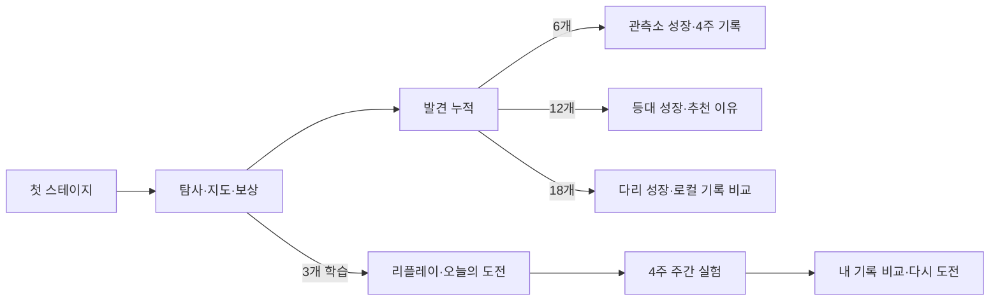

# 장기 진행·검증 보강 v1

## 범위

- 외부 링크나 서버 업로드 없이 현재 세션만 JSON으로 내보낸다.
- 기존 개별 도움 설정과 기록 귀속 계약을 유지한다.
- 초반에는 핵심 활동만 보여 주고, 세 스테이지 이후 리플레이·오늘의 도전을 연다.
- 시설은 복구 뒤 한 번 더 성장하며 실제 메뉴 기능과 연결된다.
- 주간 실험은 네 가지 주제를 순환하고 최근 네 주 완료를 표시한다.
- 경쟁은 외부 링크가 아니라 같은 기기의 검증된 리플레이 두 개 비교부터 시작한다.
- 모든 소리·진동 사건은 같은 의미의 시각 문구와 스크린리더 문구를 가진다.
- 실기기 성능과 별개로 반복 물리 판정 회귀를 진단하고, 빠른 테스트와 전체 테스트를 분리한다.

## 진행 흐름

## 개인정보와 공유 경계

세션 내보내기는 `property-shot-local-session/v1` JSON이다. 절대 시각과 내부 `session_id`를 제거하고 사건 순서만 남긴다. `external_link_created=false`를 명시하며 자동 업로드·외부 URL·계정 식별자를 만들지 않는다.

리플레이 비교는 이미 무결성 검사를 통과해 기기에 저장된 문서끼리만 수행한다. 스테이지와 패턴이 다르면 비교를 거부한다. 비교 결과는 발사 수, 평균 힘, 사용 속성 수처럼 설명 가능한 값으로 제한한다.

## 성능·테스트 운영

- `scripts/test_fast.sh`: 개발 중 정적 분석과 핵심 저장·UI·Validator 계약.
- `scripts/test_extended.sh`: 전체 직렬 Flutter 테스트와 1,200회 물리 판정 진단. Pages 배포는 이 전체 게이트를 통과해야 한다.
- `tool/long_session_performance_probe.dart`: 표본을 고정 길이 목록에만 보관하고 p50/p95/p99를 출력한다.
- 벽시계 시간은 개발 환경에 민감하므로 CI의 물리 정답 판정으로 사용하지 않는다. 실기기 프레임은 별도 프로파일링 결과로 판단한다.

## 참고 원칙

- Apple의 게임 온보딩 지침처럼 핵심 루프를 먼저 경험하게 하고 비핵심 메뉴를 단계적으로 공개한다.
- Xbox Accessibility Guideline의 난이도·감각 대체 원칙에 맞춰 도움을 세분화하고, 소리나 색 하나에만 의미를 맡기지 않는다.
- 정밀 조작 도움은 예상 위치와 버튼식 각도·힘 조절을 함께 제공하되 경쟁 기록과 분리한다. 웹과 모바일 모두 사건별 효과음을 같은 시각·스크린리더 문구와 결합한다.
- Android 및 Flutter 성능 지침에 따라 평균값보다 p95/p99와 장시간 반복에서의 변화를 함께 본다.
