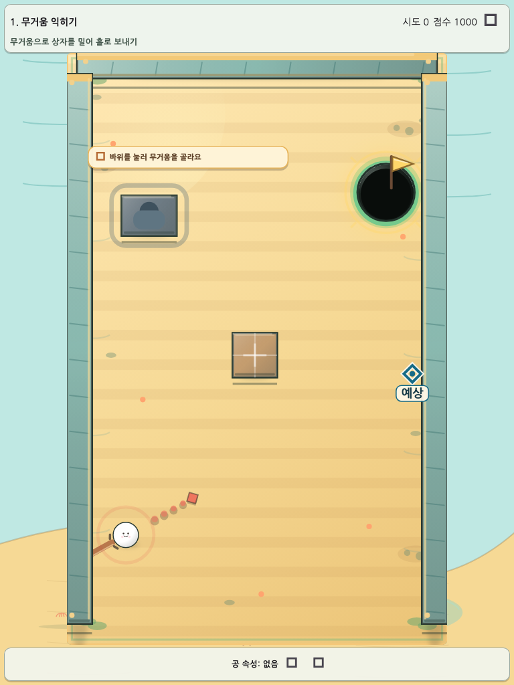
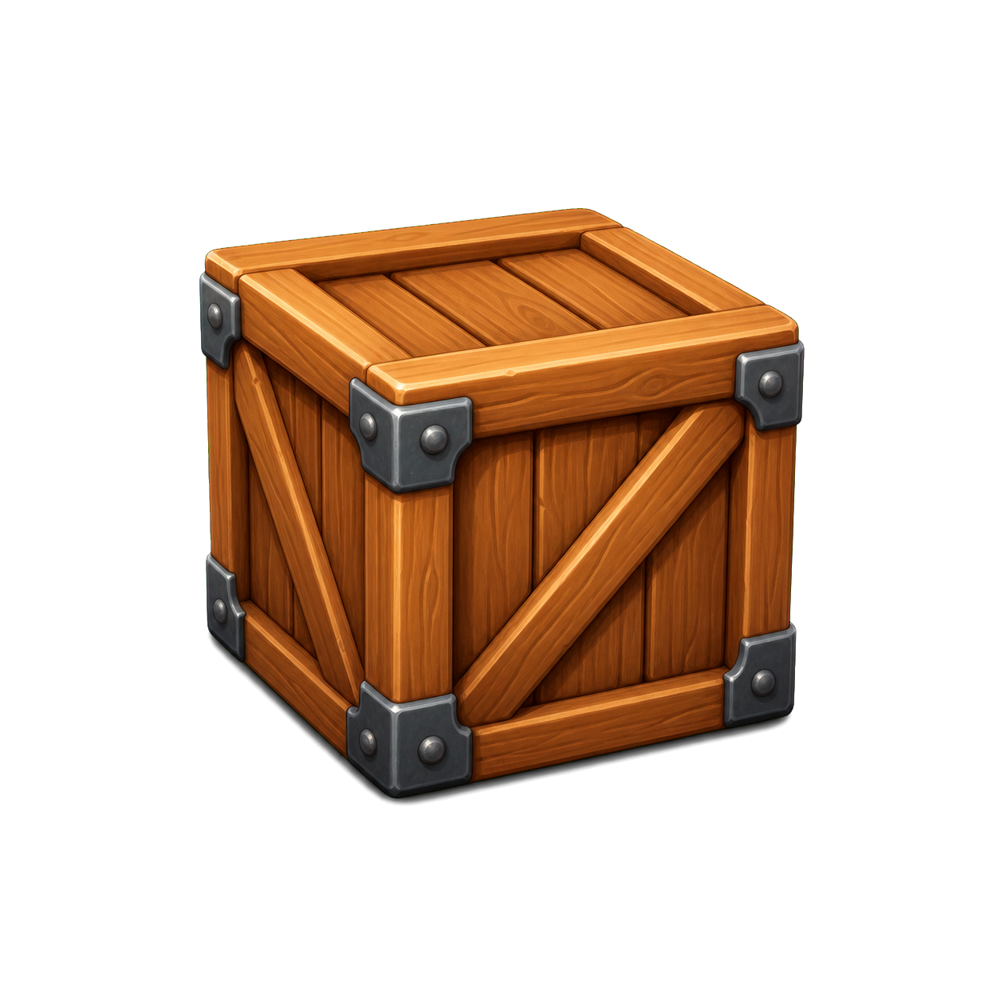

# 속성 한방(Property Shot) AI 활용 기술 문서

작성일: 2026-08-10 KST
기능 기준: `main` 작업 트리 / 기반 커밋 `bfb7a39734cad39b458273a6bca55a5485950d7c`
제출 형식: AI 활용 기술 PDF

## 1. AI 활용 개요

속성 한방은 사람이 게임 철학·난이도 정책·출시 범위를 결정하고, Codex가 저장소 분석·구현·테스트·문서화의 반복 작업을 수행한 협업 프로젝트다. AI 결과는 바로 채택하지 않고 코드 회귀, Golden 화면, 정적 분석, 출시 빌드, 독립 감사로 검증했다.

| 역할 | 책임 |
|---|---|
| 사람 | 게임 규칙, 사용자 경험, 난이도/기록 정책, 최종 승인 |
| Terra 실행 에이전트 | 애셋·보고서·게이지·튜토리얼·난이도별 독립 분석과 구현 |
| Sol 총괄 검사 에이전트 | 설정 충돌, 결정론, 기록 공정성, 접근성, 증거 완결성의 독립 감사 |
| Codex 루트 에이전트 | 작업 순서·공유 파일 충돌 제어, 통합 테스트, 빌드, 배포, 문서 산출 |

요청된 `5.6 luna`는 현재 환경에서 제공되지 않아 실행 담당은 `gpt-5.6-terra`, 총괄 검사는 요청대로 `gpt-5.6-sol`을 사용했다.

## 2. 개발 구조와 AI 적용 지점

| 계층 | 주요 파일 | AI 활용 내용 |
|---|---|---|
| 도메인/물리 | `lib/game/simulation/shot_resolver.dart` | 결정론적 충돌 판정, 쉬움 모드 첫 도착 read-only preview |
| 캠페인 진행 | `lib/game/run/stage_pattern_session.dart`, `campaign_stage_selection.dart`, `run_hint_state.dart` | 최초 학습 기준 패턴 정책, RunState v3 힌트 권한·열쇠·저장 큐 |
| 힌트 데이터 | `lib/game/hint/*`, `assets/stages/hints_v1.json` | 40패턴 L1/L2, 비물리 열쇠, 시연 계약, 생성기·Validator |
| 입력/UI | `lib/ui/game_screen.dart`, `launch_input_session.dart` | 직선 게이지, 상태/접근성, 예상 위치 표시 |
| 기록 공정성 | `run_difficulty_attribution_store.dart` | 완료 당시 난이도를 sidecar로 귀속해 Normal 기록 보호 |
| 설정 | `lib/ui/game_feedback.dart`, `lib/main.dart` | schema 4에서 게이지 위치·난이도를 한 번에 마이그레이션 |
| 검증 | `test/*`, `test/goldens/*` | 결정론·복구·접근성·viewport·픽셀 회귀 자동화 |

### 2.1 증거 기반 반복 흐름

1. 사용자 요구를 기능 계약과 모호점으로 분해한다.
2. 실행 에이전트가 관련 코드·테스트·권리 문서를 읽고 설계안을 낸다.
3. 공유 설정/저장/렌더 파일의 편집 순서를 직렬화한다.
4. 기능 구현 뒤 집중 테스트와 Golden을 실행한다.
5. Sol 검사 에이전트가 파일을 수정하지 않고 P0/P1/P2를 판정한다.
6. P1이 있으면 같은 담당자에게 되돌려 수정·재감사한다.
7. 전체 테스트, 정적 분석, Web/APK 빌드와 공개 배포를 최종 게이트로 사용한다.

## 3. 주요 프롬프트와 지시 사항

### 3.1 원 프로젝트 고도화 지시

**목적:** 기존 물리·저장·리플레이를 보존하면서 여러 전문 역할이 독립 분석 후 교차 검증하도록 한다.

**대표 지시 요약:**

> 기존 코드를 보존하고 역할별 에이전트가 고속 충돌, 결정론, 연쇄 애니메이션, 튜토리얼, QA 위험을 분석한다. 제안은 문제-증거-구현-테스트 경로로만 반영하고, 최종 근거는 실행 로그와 저장소 증거로 남긴다.

출처: `harness_docs/prompts/current_goal.md`, `harness_docs/prompts/agent_prompts.md`

### 3.2 이번 접근성·난이도 개선 지시

**사용자 요구 요약:**

- 공을 누른 손가락이 게이지를 가리므로 기본 오른쪽·설정 왼쪽의 직선 게이지로 바꾼다.
- 색 단계는 초록→노랑→빨강→점멸 빨강→회색으로 유지한다.
- 튜토리얼을 조금 쉽게 하고, 쉬움/보통 난이도를 제공한다.
- 쉬움은 발사선의 예상 1차 도착 위치를 표시하고 보통은 현행을 유지한다.
- 게임 소개 PDF와 AI 활용 기술 PDF를 분리하고, 실제 애셋·영상·Pages 배포까지 검증한다.

**총괄 제약:**

- 설정 schema는 게이지 위치와 난이도를 한 번에 올린다.
- `_01` 우선은 캠페인 1–4단계 첫 학습에만 적용하고 오늘의 도전·리플레이와 격리한다.
- 쉬움은 진행 해금만 공유하며 보통 최고 기록을 덮지 않는다.
- 공식 오늘의 도전은 보통으로 고정한다.
- PDF는 기능·테스트·캡처가 끝난 뒤 생성한다.

## 4. AI 지원 구현 사례

### 4.1 중앙 편향 부유 충전 게이지

기존 `LaunchInputSession`의 450ms 활성화, 0.40/0.70/0.90 경계, 1680ms 과충전 계약은 바꾸지 않았다. 공 주변 원형 링을 제거하고 공 가까이에서 홀·풍선·파워 슬라이더·열쇠 등 핵심 기물을 피하는 34px 부유 rail로 옮겼다. 오른손/왼손 설정은 공 반대쪽 후보의 우선순위를 바꾸며, 실제 겹침 검사가 최종 위치를 정한다.

접근성 감사에서 퍼센트를 80ms마다 liveRegion으로 읽는 문제와 450ms 전 50%가 보이는 문제가 발견됐다. 상태 전이만 live로 읽고 퍼센트는 non-live로 분리했으며, 실제 충전 시작 전에는 레일을 숨겼다.

### 4.2 튜토리얼 완화

공용 `StageShuffleBag`을 수정하지 않고 캠페인 선택 정책에서 fresh cycle의 첫 항목과 metadata baseline만 교환했다. 재시도·저장 재개는 현재 pattern/seed를 먼저 복원하고, 클리어 뒤에는 기존 셔플을 계속 소비한다.

실패 도움말은 정답 각도와 힘 대신 기믹의 인과만 보여준다. 3단계 2회 실패 카드는 접근성 중복 낭독과 작은 화면 말줄임까지 별도 감사했다.

### 4.3 쉬움 모드 예상 첫 도착

별도 근사 물리를 만들지 않고 실제 `ShotResolver.resolve()` 결과에서 경로상 가장 이른 impact·hole·power slider를 고른다. 사건이 없으면 range end를 사용한다. 캐시 키만 1도/1%로 양자화하고, 미리보기와 실제 발사는 동일한 정확한 방향·힘 snapshot을 공유한다.

### 4.4 난이도별 기록 귀속

AI 감사에서 앱 재개 중 현재 설정이 완료 당시 난이도를 덮을 수 있는 위험을 세 차례 발견했다. 최종 구현은 `runId + stage + pattern + seed` identity의 sidecar를 **first-write-wins**로 저장하고, 정상 완료·완료 상태 복구·성공 샷 직후 크래시 복구가 동일 귀속을 사용한다.

Normal/Easy/metadata 없음 × 3개 완료 경로의 9개 조합에서 진행 해금은 항상 공유하고, Normal만 최고 기록·보너스를 갱신하며, 성공 트랜잭션 뒤 sidecar 삭제를 검증했다.

### 4.5 기믹 우위·보상 시각 언어

사용자 캡처에서 드러난 직행 우회를 막기 위해 기준·변형 패턴의 홀·벽·문·스위치 배치를 조정했다. 자동 검증은 40개 생산 패턴을 모두 순회한다. 단발 32패턴은 기믹 성공 영역이 무기믹 우회보다 개별 1.40배 이상이어야 한다. 7·10단계는 같은 900개 최종 입력을 준비 상태와 초기 상태에 각각 적용해 표본 분모를 같게 하고, typed 준비 사건·문 상태 변화·같은 최종 입력 실패를 먼저 증명한다. 8단계는 같은 홀 진입에서 연쇄 점수 1.45배 이상을 요구한다.

기존 런 보상 8종과 다음 스테이지 팁 1종, 총 9종은 Flutter의 무료 Material Icons에서 기능별 아이콘을 매핑했다. 청록/금색 꾸미기는 공 본체의 채움·테두리·하이라이트를 함께 바꿔 다음 스테이지에서도 변화가 식별되도록 했고, 비교 Golden과 실제 단계 Golden을 추가했다.

### 4.6 패턴 힌트·비물리 열쇠·저장 복구

`HintCatalog v1`은 40개 생산 패턴 각각에 정확히 L1·L2를 제공한다. Validator는 잘못된 패턴/기물 참조, 누락·중복·L3, 숫자 정답과 추상 문장을 거부한다. 다음 단계 팁 보상은 이미 선추첨된 다음 패턴 정체성에 결속하고, 일일 도전에서는 사용할 수 없는 후보를 제외한다.

열쇠 판정은 `ShotResolver` 물리에 엔티티를 추가하지 않고, 확정된 현재 공·과거 공 경로의 모든 접촉 후보를 시간순으로 정렬해 열쇠별 첫 직접 접촉만 채택한다. 느린 저장 중에도 샷 애니메이션은 바로 진행되고, 저장 성공 뒤에만 열쇠 제거·VFX·힌트 버튼을 반영한다. `RunState v3`는 v1/v2 마이그레이션, L3→L2 clamp, 실패 전후 기준값과 권한 불변식을 검증한다.

## 5. 검증 및 AI 결과 채택 기준

| 검증 | 최종 결과 |
|---|---|
| 전체 회귀 | 단 한 번의 직렬 실행 1,062건 중 997건 통과·65건 실패. stale Golden 61장과 레벨 7·10 replay fixture를 실제 결과에 맞춰 검토한 뒤 Golden 67/67, replay·결정론 9/9, 핵심 변경 239/239를 표적 재검증 |
| 정적 분석 | 문제 0건 |
| 보통 모드 화면 | 320×568·375×812를 포함한 화면 기준과 최종 하단 문구 변경 영향권 Golden 표적 통과 |
| 신규 게이지 | 좌/우 × 5상태, 모바일/태블릿, 저모션·점멸 끄기 Golden/위젯 통과 |
| 쉬움 모드 | 첫 도착 단위·위젯·390/768 Golden 통과 |
| 복구/공정성 | direct·stageCompleted·shot-success crash × 3귀속 행렬 통과 |
| 기믹 우위 | 10단계 × 4패턴 전수 검증, 단계 합계 최소 1.4배 또는 후반 인과·점수 게이트 통과 |
| 보상·꾸미기 | 기존 8종+다음 스테이지 팁 1종의 고유 아이콘과 청록/금색 본체 변화 Widget/Golden 통과 |
| 출시 빌드 | Web release 통과(`main.dart.js` 3,709,343바이트, SHA-256 `cb95f03f...cc537f`), Android release APK 63,261,407바이트·SHA-256 `f2a12703...146674` 통과 |
| 영상·배포 | 19소스 Golden 68건·freshness·실제 telemetry attestation·60.000초 H.264/avc1 MOV·identity transform·대표 27프레임 시각 검사 통과. Pages 재배포는 문서 재생성 뒤 수행 |
| 독립 감사 | 코드·레벨·영상 핵심 감사 통과. 최종 문서·배포 감사는 최신 산출물·Pages 확인 뒤 확정 |

이번 단일 전체 실행에서 실패한 Golden 61개는 실제 렌더를 직접 비교했다. 차이는 모두 하단 조작 안내를 `물체를 눌러 속성 고르기`로 단축해 한 줄로 만든 영역에 국한됐고, 해당 6개 Golden 파일 묶음의 67개 테스트가 갱신 후 재통과했다.

### 5.1 Web 성능 증거의 범위

2026-08-10 최신 Web Release를 에이전트·빌드 작업이 없는 상태에서 뷰포트별 3회 다시 측정했다. 390×844와 768×1024 모두 발사 구간 rAF p90 17.2ms, p99 17.6ms, 누락·50ms 초과·Long Task·콘솔 오류 0건이었다. 평균은 16.664–16.666ms였으며 과거 자원 경합 회차의 급등은 재현되지 않았다. 16.7ms p90 목표는 0.5ms 초과했으므로 엄격 목표 통과로 과장하지 않고, 브라우저 rAF 대리값을 실제 기기 성능으로 확대하지 않는다.

## 6. AI 생성 이미지 애셋

아래 세 PNG는 실제 앱 bundle에서 런타임에 사용한다. 원본 1254×1254 이미지를 게임 로딩 시 256px로 decode한다.

### 6.1 무거움 돌

- 경로: `assets/generated/stone-v2.png`
- SHA-256: `d821a5e2dbedb4e4a69bed54c5c3b2d613d9cba9b8d316055f158d07068b7251`
- 생성: Codex 이미지 생성 후 배경 키 제거·투명화

### 6.2 탄성 젤리

- 경로: `assets/generated/jelly-bumper-v1.png`
- SHA-256: `bc8434b0a386724008557d5e7c67a4e9129c7ae8d371877fd4222943a848a30c`
- 생성: AI 생성 후 알파 수축 보정

### 6.3 상자

- 경로: `assets/generated/crate-v2.png`
- SHA-256: `3d0b267716599be44865ad5b07421257ebc6a2a07a0c856b58d67bdbc2f8eaed`
- 생성: Codex 이미지 생성 후 배경 키 제거·투명화

풍선·뾰족함 원본·속성 공은 외부 PNG가 아니라 `property_shot_game.dart`와 `game_ball_painter.dart`의 Canvas 코드로 그린 자체 표현이다.

## 7. 외부 에셋과 오픈소스 출처

### 7.1 런타임 의존성

| 구성 | 버전/제약 | 용도 | 라이선스·공식 출처 |
|---|---|---|---|
| Flutter | SDK | 앱 프레임워크 | BSD-3-Clause · [flutter.dev](https://flutter.dev/) |
| Flame | 1.38.0 | 게임 루프·Canvas 렌더 | MIT · [pub.dev/flame](https://pub.dev/packages/flame) |
| shared_preferences | 2.5.5 | 로컬 설정·sidecar 저장 | BSD-3-Clause · [pub.dev/shared_preferences](https://pub.dev/packages/shared_preferences) |
| crypto | 3.0.7 | 무결성·해시 | BSD-3-Clause · [pub.dev/crypto](https://pub.dev/packages/crypto) |
| audioplayers | 6.8.1 | 배경음·효과음 | MIT · [pub.dev/audioplayers](https://pub.dev/packages/audioplayers) |
| NanumGothic | bundled TTF | 한글 UI·보고서 렌더 | SIL OFL 1.1 · [NAVER Nanum](https://hangeul.naver.com/font) |
| Material Icons | Flutter bundled font | 기존 런 보상 8종+다음 스테이지 팁 1종 아이콘 | Apache-2.0 · [Flutter Icons API](https://api.flutter.dev/flutter/material/Icons-class.html), [Google Material Icons](https://github.com/google/material-design-icons) |

### 7.2 외부/레거시 에셋

| 자산 | 출처 | 라이선스 | 제품 bundle |
|---|---|---|---|
| `assets/icons/ball.png`, `crate.png`, `stone_boulder.png` | [OpenGameArt `Smooth Physics Obstacle Props`](https://opengameart.org/content/smooth-physics-obstacle-props) | [CC0 1.0 법적 코드](https://creativecommons.org/publicdomain/zero/1.0/legalcode) | 미사용 레거시·권리 증빙 보관 |
| `property_shot_island_loop.wav` | 프로젝트 도구로 자체 합성, 외부 샘플 없음 | 프로젝트 자체 생성 | 사용 |
| 생성 PNG 3종 | Codex 이미지 생성·프로젝트 후처리 | 조건부 승인, 최종 권리 검토 필요 | 사용 |

권리·해시·bundle 경계의 상세 근거는 `harness_docs/release/asset_rights_ledger.md`, `harness_docs/release/store_assets.md`, `harness_docs/assets/asset_registry.md`에 보존한다.

## 8. AI 활용의 한계와 책임

- AI가 만든 코드·이미지는 실행 결과와 권리 기록을 별도로 검증해야 한다.
- 자동 테스트는 게임 재미와 실제 초보자의 이해도를 완전히 증명하지 못한다.
- iOS 실기기, 외부 사용자 정식 플레이테스트, App Store·법무 제출은 별도 인간 검토가 필요하다.
- 생성 이미지의 상업적 사용 가능성은 플랫폼 약관과 최종 법무 판단을 다시 확인해야 한다.
- 최종 게임 설계와 출시 판단의 책임은 프로젝트 소유자에게 있다.

## 9. 추적 가능한 근거

- 기능 기준: `main` 작업 트리 / 기반 커밋 `bfb7a39734cad39b458273a6bca55a5485950d7c`
- QA 결과: `harness_docs/qa/validation_results.md`
- 에이전트 작업 맥락: `harness_docs/prompts/*`, `harness_docs/dev-wiki/log.md`
- 에셋 권리: `harness_docs/release/asset_rights_ledger.md`
- 공개 플레이: [GitHub Pages](https://good5229.github.io/Property_shot/)
- 배포 기록: [GitHub Pages run 31315470165](https://github.com/good5229/Property_shot/actions/runs/31315470165)
