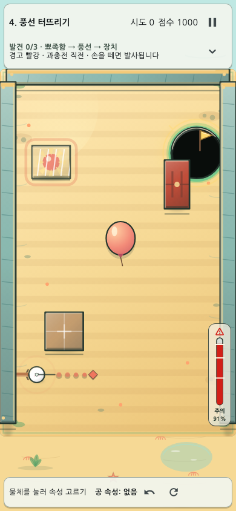
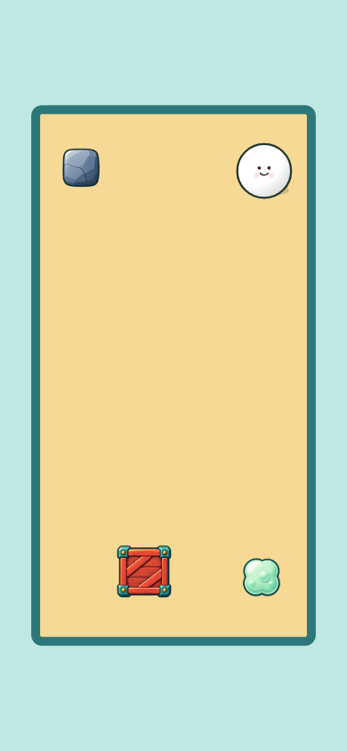

# 속성 한방(Property Shot)

## 1. AI를 ‘작업자’가 아니라 ‘검증 가능한 제작 조직’으로 사용했다

처음부터 AI에게 게임 전체를 맡기지는 않았다. 재미의 방향과 난이도 정책은 사람이 정하고, 저장소 조사·구현·테스트·감사는 서로 다른 역할로 나눴다. 한 에이전트가 만든 결과를 다른 에이전트가 다시 확인하게 한 이유는 단순했다. 물리 퍼즐에서는 작은 수치 하나가 리플레이와 기록까지 흔들 수 있기 때문이다.

프롬프트에는 원하는 결과만 쓰지 않았다. 바꾸지 말아야 할 규칙, 확인해야 할 화면, 통과해야 할 테스트를 함께 적었다. 덕분에 AI가 낸 제안을 그대로 받기보다 비교하고 고칠 수 있었다.

## 2. 사람의 결정, AI 실행, 독립 AI 감사

[[ROLE_MAP]]

사람은 무엇이 재미있는지와 어떤 결과를 받아들일지를 결정했다. 실행 AI는 그 판단을 코드·데이터·문서로 옮겼다. 독립 감사 AI는 구현자의 설명을 믿지 않고 테스트, 렌더, 저장 복구, 수치 산식을 다시 확인했다. 최종 채택 여부는 다시 사람이 판단했다.

| 영역 | 사람 | AI 실행 | 독립 AI 감사 |
|---|---|---|---|
| 핵심 게임 아이디어 | 속성 이전과 장면 변화의 재미를 결정 | 규칙 대안과 구현안을 제시 | 별도 감사 없음 |
| 스테이지 설계 | 학습 순서와 난이도 기준을 승인 | 10단계·40패턴과 대표 해법 구현 | Validator·회귀·기믹 우위 재검증 |
| ShotResolver | 물리 규칙과 허용할 풀이를 승인 | 결정론적 판정기 구현·수정 | 반복 결과·리플레이 지문 감사 |
| 힌트 | 구체성, 공개 단계, 정답 노출 금지 기준 결정 | 40패턴 L1/L2 작성·연결 | 패턴·기물 참조와 저장 복구 검사 |
| UI | 사용성 피드백과 최종 화면 승인 | 게이지·난이도·보상·열쇠 구현 | Golden·접근성·SafeArea 감사 |
| 보고서 | 전달할 메시지와 우선순위 결정 | 원고·PDF·PPT 생성 | 수치·출처·렌더 결과 대조 |

## 3. AI가 틀렸고, 검증 과정이 잡아낸 세 사례

성공 사례만 나열하면 AI를 어떻게 통제했는지 알기 어렵다. 이 프로젝트에서는 AI의 제안과 구현도 테스트 대상이었다. 아래 세 사례는 독립 감사에서 반려된 뒤 계약과 회귀 테스트까지 고친 대표 사례다.

### 3.1 서로 다른 표본을 비교한 기믹 우위 지표

첫 자동 검증은 크기가 다른 입력 표본의 **성공 개수**를 그대로 나눴다. 숫자는 커 보였지만 통계적으로 비교할 수 없는 값이었다. 감사 AI가 계산 방식을 반려했고, 준비 전과 준비 후를 같은 900개 입력 격자에서 비교하도록 다시 설계했다. 같은 마지막 샷이 준비 전에는 실패하는지와 실제 기믹 사건이 발생했는지도 함께 검사했다.

### 3.2 80ms마다 말하던 파워 게이지

게이지를 화면 중앙 쪽으로 옮긴 첫 구현은 퍼센트 변화를 live semantics로 내보냈다. 화면 읽기 도구가 약 80ms마다 힘 수치를 읽을 수 있어 오히려 사용성을 해쳤다. 감사 뒤 색 단계만 live 알림으로 남기고, 퍼센트는 필요할 때 읽을 수 있는 non-live 정보로 분리했다.

### 3.3 재개 시 완료 난이도가 바뀔 수 있던 저장 구조

쉬움 모드의 기록을 보통 기록과 분리했지만, 앱을 재개할 때 **현재 설정**이 과거 완료 건의 난이도를 덮을 가능성이 발견됐다. 완료 건의 run·stage·pattern·seed에 난이도를 한 번만 귀속하는 first-write-wins 저장을 추가했다. 정상 완료, 완료 상태 복구, 성공 직후 크래시 복구를 `보통 / 쉬움 / 귀속 정보 없음` 행렬로 검증했다.

이 세 사례는 AI를 많이 썼다는 사실보다 더 중요한 결론을 남겼다. **AI가 만든 코드, 지표, 문장도 다른 AI와 실행 증거로 다시 확인해야 한다.**

## 4. 프롬프트가 실제 작업으로 바뀌는 흐름

### 4.1 공통 제작 루프

[[WORKFLOW]]

사용자 피드백을 기능 계약으로 바꾸고, 담당 에이전트가 구현한 뒤 독립 감사와 실행 증거를 거쳐 통합했다. 감사에서 문제가 나오면 완료로 처리하지 않고 계약 단계로 되돌렸다.

### 4.2 실제 프롬프트를 작업 계약으로 바꾼 예

| 실제 프롬프트 발췌 | 계약으로 변환한 제약 | 수행·검증 결과 |
|---|---|---|
| “모바일에서는 손가락 때문에 게이지가 잘 안 보인다.” | 입력 임계값과 물리는 유지, 기물·SafeArea·저모션을 보호 | 부유 직선 게이지, 좌·우 선호, 접근성·Golden 검사 |
| “게임이 좀 어렵다. 튜토리얼을 조금만 더 쉽게.” | 캠페인 첫 학습만 완화, 오늘의 도전·리플레이·기록 공정성은 불변 | 기준 패턴 우선, 인과 힌트, 쉬움 예상 도착 표시 |
| “팁은 너무 추상적이면 안 된다.” | 정답 숫자 직행 금지, 패턴·버전·대상 기물에 결속 | 40패턴 L1/L2와 선택형 열쇠, 저장·복구 검증 |
| “모든 스테이지에서 기믹 활용이 매우 유리하도록 검증.” | 준비 전·후를 같은 입력 집합에서 비교, 실제 기믹 사건 필수 | 잘못된 1차 지표를 반려하고 레벨·검증 계약 재설계 |

프롬프트 전문과 결과 이력은 `harness_docs/prompts/prompt_history.md`에 요약되어 있으며, 원래 요구·역할별 지시·최종 변경 기록을 분리해 보존한다.

## 5. 주요 프롬프트가 만든 기능

### 5.1 손가락에 가리는 파워 게이지

사용자는 모바일에서 공 주변 게이지가 손가락에 가린다고 설명했다. 발사 감각이 달라지지 않도록 입력 임계값은 그대로 두고, 표시만 공 가까이의 직선형 게이지로 옮겼다. 화면 안의 홀·풍선·슬라이더·열쇠와 겹치지 않는 후보를 고르고, 좌우 손 선호도 반영했다.

### 5.2 게임이 어렵다는 피드백

첫 플레이에서 복잡한 변형이 바로 나오는 문제부터 줄였다. 1–4단계의 첫 진입만 기준 패턴을 먼저 보여 주고, 이후 셔플과 리플레이 규칙은 건드리지 않았다. 쉬움 모드는 별도 근사 물리를 만들지 않고 실제 판정기의 결과를 읽어 첫 도착 위치만 표시한다.

### 5.3 추상적인 팁을 구체적인 플레이 도움으로

“기믹을 활용하세요” 같은 문장은 실제 행동으로 이어지지 않았다. 그래서 40개 패턴마다 L1과 L2를 따로 썼다. L1은 첫 행동을, L2는 조준 위치·세기·순서·예상 결과를 설명한다. 팁은 보상이나 열쇠를 선택한 플레이어에게만 열린다.

힌트는 `stageId + patternId + hintVersion`에 결속되어 잘못된 패턴의 답을 보여 주지 않는다. 열쇠 수집과 힌트 열람은 재시작·복구 뒤에도 유지된다.

## 6. StagePatternValidator는 AI가 만든 레벨을 등록 전에 걸러낸다

레벨 데이터가 JSON 문법에 맞는지만 보는 도구가 아니다. 새 패턴이 들어오면 정적 구조, 실제 물리, 반복 결과를 차례로 검사하고, 실패 이유를 안정된 코드로 남긴다.

[[VALIDATOR_FLOW]]

정적 검사에서는 기물 겹침, 필드 이탈, ID·연결 상태, Hint/Key 참조를 확인한다. 물리 검사에서는 홀 접근, 의도하지 않은 직선 클리어, 대표 기믹 경로, 홀 관통, 슬라이더 터널링, 무한 반사와 소프트락을 살핀다. 같은 입력의 결과가 반복 실행에서도 같아야 다음 단계로 넘어간다.

가장 중요한 점은 **검증기가 있다고 믿지 않았다는 것**이다. 겹침, 잘못된 참조, 도달 불가능한 열쇠, 홀 관통, 무한 반사 같은 오류를 일부러 넣은 invalid fixture를 만들고, Validator가 정해진 오류 코드로 실제 탐지하는지 역검증했다. AI가 생성한 40개 패턴뿐 아니라 AI가 만든 검증 도구 자체도 다시 시험한 셈이다.

| 검증 결과 | 의미 |
|---|---|
| 단발형 32패턴 각각 ≥1.40배 | 각 변형에서도 기믹 경로가 더 넓다 |
| 잔류 공 단계 합계 1.92배 | 첫 샷으로 준비한 상태가 다음 성공을 유의미하게 넓힌다 |
| 속성 통합 4패턴 모두 우위 | 스위치·문·점착·슬라이더의 준비가 핵심 해법이다 |
| invalid fixture 역검증 | 검증 규칙을 일부러 끄면 fixture 계약이 실패한다 |

## 7. 게임과 AI 시스템 구조

| 계층 | 역할 |
|---|---|
| Stage data | 10단계·40패턴, 오브젝트·해법·힌트 메타데이터 |
| ShotResolver | 방향·힘·속성으로 결정론적 결과 계산 |
| RunState | 진행, 잔류 공, 보상, 힌트 권한, 열쇠 수집을 저장 |
| GameScreen / Flame | 입력·Canvas 렌더·접근성·피드백 |
| StagePatternValidator | 정적 구조·물리·결정론·invalid fixture 검증 |
| Report pipeline | PDF·A4 세로 PPT의 재생성과 시각 검사 |

## 8. 사용한 AI 도구와 역할

| 도구 | 사용 방식 |
|---|---|
| Codex 코드 에이전트 | 저장소 탐색, Flutter/Dart 구현, 테스트·문서 파이프라인 실행 |
| gpt-5.6-terra 실행 에이전트 | 기능별 분석·구현과 표적 회귀 |
| gpt-5.6-sol 감사 에이전트 | 코드를 수정하지 않는 독립 P0/P1/P2 감사와 재검증 |
| 이미지 생성 도구 | 돌·젤리·상자 원본 생성; 투명화·권리대장·실제 번들 여부를 별도 관리 |

모델 이름보다 중요한 운영 원칙은 구현과 감사를 분리하고, 실행 증거가 없는 주장은 채택하지 않는 것이었다.

## 9. 외부 에셋과 오픈소스

| 구성 | 용도 | 출처·라이선스 |
|---|---|---|
| Flutter | 앱 UI·멀티플랫폼 | BSD-3-Clause · [flutter.dev](https://flutter.dev/) |
| Flame | 게임 루프·Canvas | MIT · [pub.dev/flame](https://pub.dev/packages/flame) |
| shared_preferences | 로컬 설정·저장 | BSD-3-Clause · [pub.dev](https://pub.dev/packages/shared_preferences) |
| crypto | 리플레이·산출물 무결성 해시 | BSD-3-Clause · [pub.dev](https://pub.dev/packages/crypto) |
| audioplayers | 배경음·효과음 재생 | MIT · [pub.dev](https://pub.dev/packages/audioplayers) |
| NanumGothic | 한글 UI·문서 | SIL OFL 1.1 · [NAVER Nanum](https://hangeul.naver.com/font) |
| Material Icons | 런 보상 9종 | Apache-2.0 · [Google Material Icons](https://github.com/google/material-design-icons) |

무거움 돌·탄성 젤리·상자는 AI 생성 후 투명화한 프로젝트 애셋이다. 풍선·뾰족함·공 표현은 외부 PNG가 아니라 Canvas 코드로 직접 그린다. OpenGameArt의 CC0 원본 3종은 레거시 증빙으로만 보관하고 제품 화면에는 사용하지 않는다.

