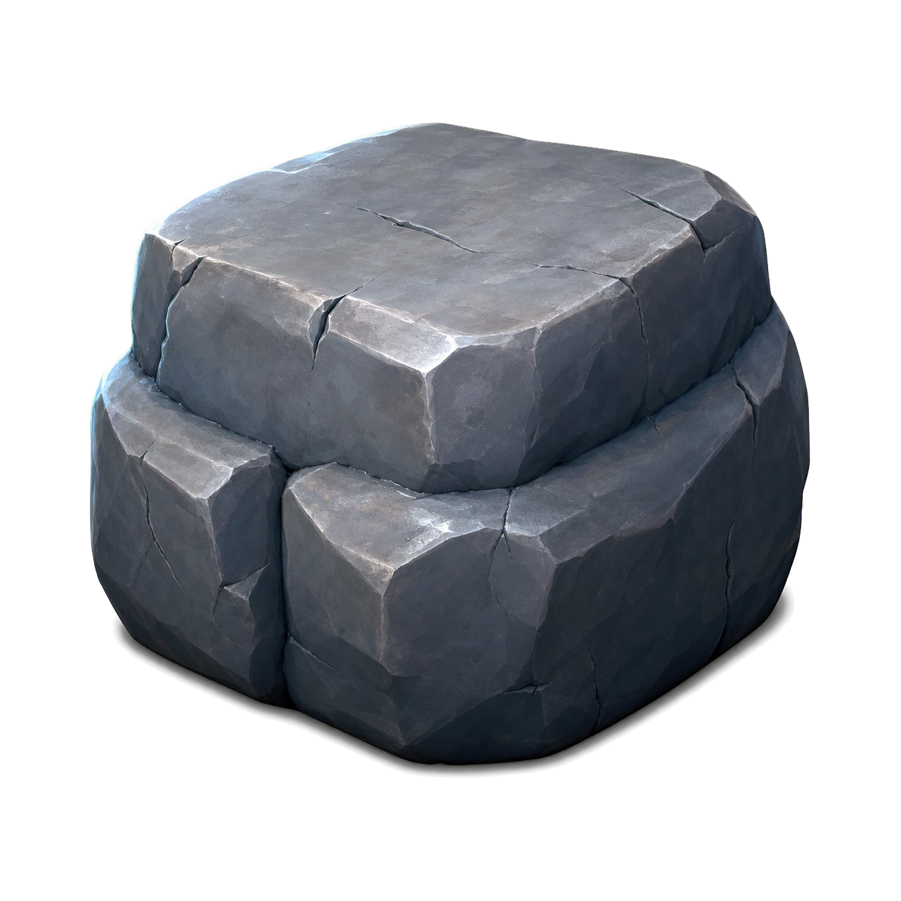
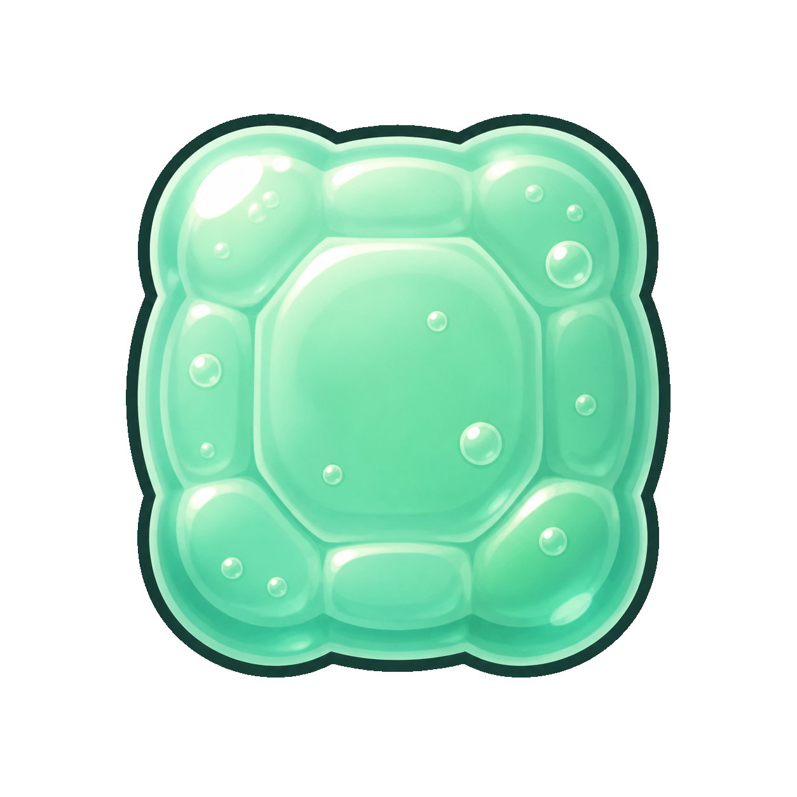
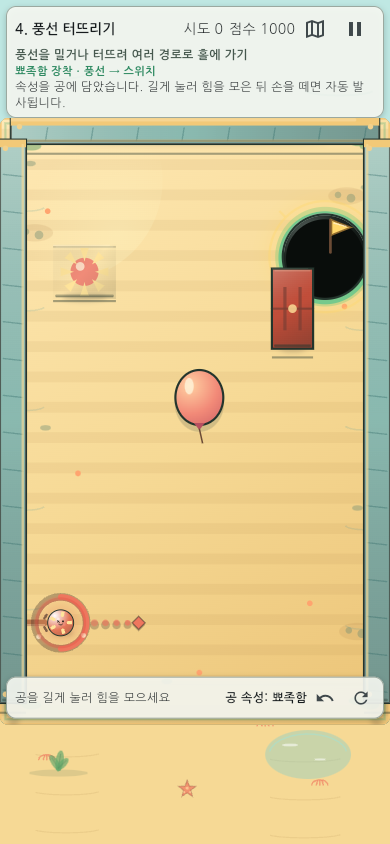
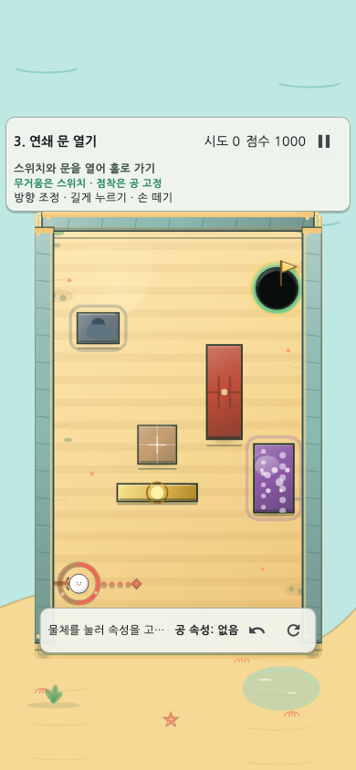
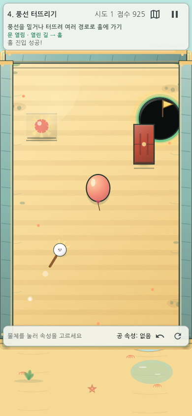

# 속성 한방(Property Shot) — 게임 소개

NAN 2026 Game × AI 해커톤 사전 과제

## 1. 한눈에 보는 게임

**속성 한방**은 주변 사물의 물리 속성을 공에 옮기고, 속성이 비워진 원본과 이전 샷의 공까지 다음 해법으로 활용하는 세로형 물리 퍼즐이다.

| 평가 포인트 | 속성 한방의 답 |
|---|---|
| 무엇이 새로운가 | 방향과 힘뿐 아니라 ‘어떤 속성을 옮길지’와 ‘바뀐 장면을 다음 샷에 어떻게 쓸지’를 설계한다. |
| 무엇이 재미있는가 | 실패한 샷도 잔류 공과 열린 문, 회전한 반사판을 남겨 다음 성공의 재료가 된다. |
| 얼마나 완성됐는가 | 10단계 × 4패턴, 총 40개 퍼즐과 튜토리얼·힌트·난이도·보상·리플레이를 플레이할 수 있다. |
| 무엇을 시연할 것인가 | 속성 이전 → 기믹 연쇄 → 장면 상태 변화 → 홀 진입의 한 사이클을 보여준다. |

## 2. 플레이어가 하는 일

### 2.1 목표와 조작

1. 맵에서 무거움·탄성·점착·뾰족함 속성을 가진 오브젝트를 고른다.
2. 속성을 공에 **이전**한다. 원본은 속성이 비워져 새로운 장면 상태가 된다.
3. 드래그로 방향을 정하고 공을 길게 눌러 힘을 모은다.
4. 초록 → 노랑 → 빨강 → 점멸 빨강 → 회색으로 바뀌는 게이지를 보고 발사한다.
5. 공이 홀에 들어가면 성공한다. 실패해도 장치 상태와 잔류 공이 유지되어 다음 샷으로 이어진다.

### 2.2 한 번의 플레이 루프

| 관찰 | 선택 | 실행 | 학습 |
|---|---|---|---|
| 홀과 장애물, 속성 원본을 읽는다 | 옮길 속성과 경로를 정한다 | 방향·힘을 조절해 발사한다 | 남은 공과 바뀐 장면으로 다음 해법을 만든다 |

이 구조 덕분에 정답을 외우는 게임보다 ‘물리 상태를 편집하는 퍼즐’에 가깝다.

## 3. 핵심 기믹과 학습 곡선

### 3.1 네 가지 속성

| 속성 | 플레이 변화 | 대표 학습 |
|---|---|---|
| 무거움 | 상자·스위치에 큰 운동량 전달 | 힘으로 장면을 바꾸기 |
| 탄성 | 벽과 범퍼에서 반사 에너지 유지 | 직선이 아닌 경로 만들기 |
| 점착 | 표면에 붙어 다음 샷의 발판이 됨 | 첫 샷을 두 번째 샷의 도구로 사용 |
| 뾰족함 | 풍선을 터뜨려 숨은 장치를 노출 | 속성 → 기물 → 문 연쇄 이해 |

### 3.2 10단계 진행 구조

| 단계 | 새로 배우는 규칙 | 플레이어가 만드는 변화 |
|---|---|---|
| 1–2 | 무거움, 탄성 | 상자를 밀고 벽 반사 경로를 만든다 |
| 3–4 | 스위치·문, 뾰족함·풍선 | 원인과 결과의 순서를 읽는다 |
| 5–6 | 비워진 원본, 파워 발판 | 속도와 원본 상태를 재활용한다 |
| 7–8 | 잔류 공, 다중 연쇄 | 실패한 공을 다음 성공 조건으로 바꾼다 |
| 9–10 | 회전 반사판, 규칙 통합 | 누적된 장면 상태와 복수 해법을 최적화한다 |

각 단계는 4개 패턴을 균등하게 순환한다. 첫 학습에서는 가장 읽기 쉬운 기준 패턴을 먼저 보여 주고, 이후에는 변형을 통해 같은 규칙을 다른 배치에서 다시 이해하게 한다.

## 4. 주요 제공 기능

### 4.1 난이도와 접근성

- **보통:** 현재 조준 정보만 제공해 퍼즐 추론을 그대로 유지한다.
- **쉬움:** 실제 판정기와 같은 계산으로 예상 첫 도착 위치를 마름모와 `예상` 라벨로 표시한다.
- 쉬움 클리어는 진행 해금에 반영되지만 보통 최고 기록을 덮지 않는다.
- 충전 게이지는 공 가까이에서 핵심 기물을 피하는 위치를 자동 선택하며 좌·우 선호를 설정할 수 있다.
- 저모션·강한 점멸 끄기·형태와 텍스트를 함께 제공해 색에만 의존하지 않는다.

### 4.2 구체적인 L1/L2 힌트와 열쇠

40개 패턴마다 두 단계의 힌트가 있다. L1은 사용할 기믹과 첫 행동을, L2는 조준 위치·세기·행동 순서·예상 결과를 설명한다. 다음 단계 팁 보상을 선택하거나 스테이지의 선택형 열쇠에 공을 닿게 하면 해당 패턴의 힌트가 열린다. 열쇠는 물리와 점수를 바꾸지 않으므로 ‘도움이 필요할 때 스스로 선택하는 보조 목표’다.

### 4.3 보상과 반복 플레이

런 보상 9종은 복사·되감기·회수·안내·도전·인과·꾸미기·기록 보호·다음 스테이지 팁을 서로 다른 무료 Material 아이콘과 텍스트로 구분한다. 청록/금색 꾸미기는 링뿐 아니라 공 본체의 그라데이션·금색 외곽선·하이라이트를 바꿔 다음 스테이지에서도 즉시 식별된다.

그 밖에 오늘의 도전, 리플레이, 실패 원인 안내, 기록 재도전을 제공한다.

## 5. 게임 설계의 차별점

### 5.1 실패가 사라지지 않는다

보통의 한 샷 퍼즐은 실패를 초기화한다. 속성 한방은 공·문·스위치·반사판의 결과를 남긴다. 플레이어는 첫 샷의 결과를 관찰하고 두 번째 샷에서 이용한다. 이 때문에 ‘정확히 쏘기’보다 ‘상태를 계획하고 수정하기’가 핵심 능력이 된다.

### 5.2 기믹을 쓰는 편이 실제로 유리하다

모든 10개 단계에서 기믹 경로가 우회보다 유리하도록 같은 입력 격자에서 40패턴을 전수 검증했다. 단발형 32패턴은 각 변형에서 최소 1.40배의 성공 영역 우위를 보였고, 여러 샷을 쓰는 단계는 준비 전·후를 같은 900개 입력으로 비교해 단계 합계 기준을 통과했다. 연쇄 점수 단계는 같은 홀 진입에서도 기믹 연쇄가 더 높은 점수를 만든다.

이는 기믹이 장식이 아니라 플레이어가 배우고 활용해야 할 핵심 규칙이라는 뜻이다.

## 6. 평가 시 권장 시연 순서

1. **30초:** 무거움 또는 탄성 속성을 공으로 이전한다.
2. **60초:** 벽 반사·스위치·문·풍선 중 하나의 인과 연쇄를 완성한다.
3. **30초:** 실패한 공이나 바뀐 장면을 다음 샷에서 활용한다.
4. **30초:** 쉬움 모드 예상 위치, 부유 게이지, L1/L2 힌트와 열쇠를 보여 준다.
5. **30초:** 클리어 보상과 공 꾸미기가 다음 스테이지에 유지되는 모습을 보여 준다.

## 7. 실행 방법

### 7.1 바로 플레이

[웹에서 바로 플레이](https://good5229.github.io/Property_shot/)

모바일 세로 화면을 권장한다. Chrome, Safari, Edge의 최신 버전에서 URL을 열면 설치 없이 시작할 수 있다.

### 7.2 Android 설치와 로컬 실행

Android에서는 프로젝트의 release APK를 기기로 옮겨 설치할 수 있다. 개발 환경에서는 Flutter SDK 설치 후 `flutter pub get`, `flutter run -d chrome` 순서로 실행한다.

### 7.3 플레이 영상

프로젝트 폴더의 `recordings/property-shot-gameplay-60s.mov`는 실제 탄성 스테이지 플레이와 주요 기능 장면을 담은 60초 H.264 영상이다. 방향 반전 없이 390×844 세로 화면으로 검증했으며, 실제 플레이 구간은 열쇠·L1/L2·탄성 이전·다중 벽 반사·비직행 클리어를 포함한다.

## 8. 완성도와 검증

| 평가 관점 | 확인한 내용 |
|---|---|
| 기능 완성도 | 10단계·40패턴, 난이도, 힌트, 열쇠, 보상, 꾸미기, 오늘의 도전, 리플레이가 연결됨 |
| 플레이 공정성 | 쉬움 기록 분리, 공식 오늘의 도전 보통 고정, 저장·재개에서도 완료 당시 난이도 유지 |
| 퍼즐 품질 | 모든 단계에서 기믹 경로 우위, 대표 해법과 근방 입력의 결정론 확인 |
| 화면 품질 | 320×568부터 태블릿까지 Golden 화면 회귀와 SafeArea·큰 글자·저모션 확인 |
| 시연 품질 | 60초 영상의 장면 길이·방향·실제 이벤트·콘솔 오류 여부를 자동 확인 |

## 9. 현재 한계와 다음 검증

- iPhone/iPad 실기기에서의 장시간 성능과 터치 체감은 추가 확인이 필요하다.
- 외부 초보자 대상 정식 플레이테스트로 힌트 사용률과 첫 클리어 시간을 더 측정해야 한다.
- 생성 이미지의 상업 공개 범위는 제출 전 최종 권리 검토가 필요하다.
