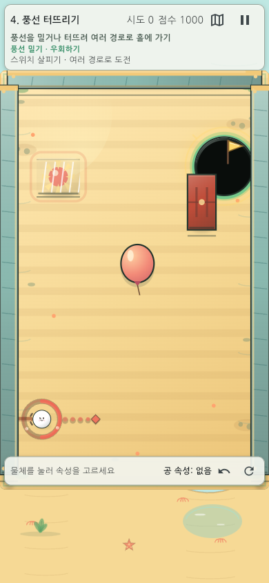
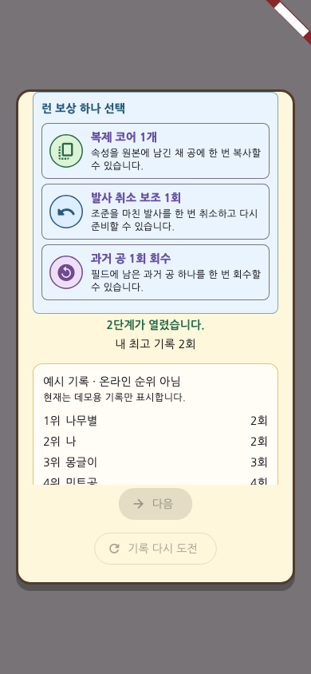
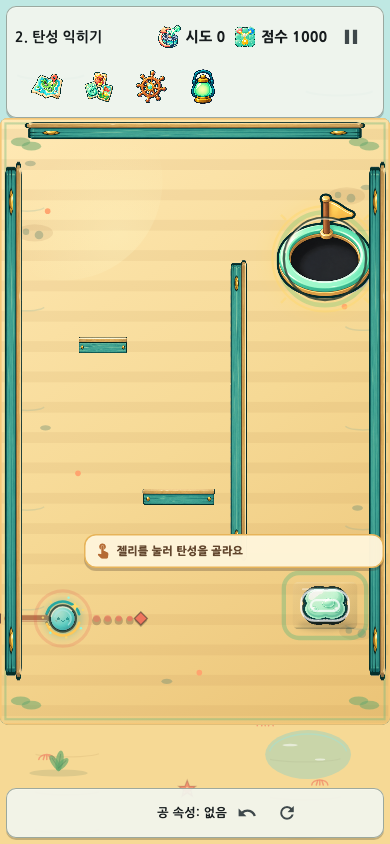

# 속성 한방(Property Shot) 게임 소개 및 설명

작성일: 2026-08-10 KST
기능 기준: `main` / 배포 커밋 `69744c6d3183b4933817066f80221c2f8fd69630`
제출 형식: 게임 소개 및 설명 PDF

## 1. 게임 제목과 한 줄 소개

- **게임 제목:** 속성 한방(Property Shot)
- **한 줄 소개:** 주변 오브젝트의 물리 속성을 공에 옮기고, 비워진 원본과 잔류 공까지 다음 해법으로 활용하는 세로형 물리 퍼즐.
- **플레이 형태:** 10단계 × 단계별 4패턴, 총 40개 데이터 기반 퍼즐.


일반적인 조준 게임이 방향과 힘에 집중한다면, 속성 한방은 **무엇의 속성을 옮길지**, **원본이 어떻게 바뀔지**, **남은 공을 다음 샷에서 어떻게 쓸지**까지 함께 판단한다.

| 핵심 질문 | 플레이어의 선택 |
|---|---|
| 어떤 속성이 필요한가? | 무거움·탄성·점착·뾰족함 중 맵에 맞는 속성을 고른다. |
| 속성을 옮긴 뒤 원본은? | 원본의 속성이 비워져 반응이 달라지는 점까지 이용한다. |
| 한 번에 실패하면 끝인가? | 아니다. 잔류 공과 바뀐 장면 상태가 다음 샷의 전략 자원이 된다. |

## 2. 게임 방법

### 2.1 목표

각 패턴의 홀에 현재 공 또는 이전 샷의 잔류 공을 넣으면 클리어한다. 일부 단계는 스위치·문·풍선·파워 발판·회전 반사판을 먼저 작동해야 홀 경로가 열린다.

### 2.2 조작

1. 속성이 있는 오브젝트를 눌러 속성을 선택한다.
2. **이전**을 선택하면 공이 속성을 얻고 원본은 비워진다. 복제 코어가 있으면 **복사**도 가능하다.
3. 공에서 드래그해 발사 방향을 정한다.
4. 공을 길게 누르면 공 근처에서 기믹을 피해 배치된 부유 직선 충전 게이지가 아래에서 위로 찬다.
5. 초록(약함) → 노랑(보통) → 빨강(강함) → 점멸 빨강(과충전 직전) → 회색(취소) 순서를 보고 손을 떼어 발사한다.
6. 게이지는 기본 오른손 설정에서 공의 왼쪽 후보, 왼손 설정에서 오른쪽 후보를 우선하되 홀·풍선·파워 슬라이더·열쇠 등 핵심 기물과 겹치지 않는 위치를 자동 선택한다. 저모션 또는 강한 점멸 끄기에서는 경고가 정적으로 표시된다.


### 2.3 종료 조건

- **성공:** 공이 홀에 들어가면 점수·진행 해금·보상 선택을 처리한다.
- **실패 샷:** 즉시 게임오버가 되지 않는다. 장치 상태와 잔류 공을 유지해 다음 샷으로 이어간다.
- **과충전:** 게이지가 회색이 되면 해당 발사는 취소된다.
- **되감기/초기화:** 직전 상태로 되돌리거나 현재 패턴을 처음부터 다시 시도할 수 있다.

## 3. 난이도와 튜토리얼

### 3.1 보통 모드

기존 조준 표시만 제공한다. 예상 충돌 위치는 표시하지 않으며 최고 점수와 선택 도전 기록은 보통 모드 결과로 관리한다.

### 3.2 쉬움 모드

조준 중 실제 판정기와 같은 계산을 읽기 전용으로 실행해 **예상 첫 도착 위치**를 마름모와 `예상` 라벨로 표시한다. 첫 벽·기물 충돌, 홀 진입, 파워 슬라이더 진입, 충돌이 없을 때의 사거리 끝을 구분한다.

쉬움 클리어도 다음 단계 해금에는 반영되지만 보통 최고 기록과 선택 도전 기록을 덮지 않는다. 공식 오늘의 도전은 보통 모드로 고정된다.


### 3.3 첫 학습 경로 완화

캠페인 1–4단계를 처음 배우는 동안에는 각 단계의 기준 패턴을 먼저 제시한다. 실패하면 정답 각도나 힘을 공개하지 않고 `무거움→상자`, `탄성→벽`, `무거움→스위치→문`, `뾰족함→풍선→스위치`처럼 기믹의 인과관계만 설명한다. 재시도·저장 재개·오늘의 도전·리플레이의 기존 결정론은 그대로 유지된다.

### 3.4 패턴별 클리어 팁과 열쇠

40개 패턴마다 L1·L2 두 단계의 팁을 제공한다. L1은 목표 기믹과 첫 행동, L2는 조준 위치·세기·행동 순서·예상 결과를 구체적으로 설명한다. 다음 단계 팁 보상을 선택하거나, 스테이지의 비물리 열쇠에 공을 직접 닿게 하면 해당 `stageId + patternId + hintVersion`의 팁 버튼이 열린다. 열쇠는 물리·점수·클리어 경로를 바꾸지 않으며 저장이 성공한 뒤에만 획득 효과가 나타난다.

작은 모바일 클리어 화면에서는 다음 스테이지 팁을 포함한 보상 선택이 점수 상세보다 먼저 보이고, 다음 버튼은 SafeArea 안의 고정 footer에 남는다. 일일 도전은 힌트 UI를 제공하지 않으므로 사용할 수 없는 팁 보상도 후보에서 제외한다.

## 4. 학습 곡선의 핵심 기믹

### 4.1 무거움


무거운 공은 상자와 장치에 더 큰 운동량을 전달한다. 속성을 이전한 돌은 비워진 원본으로 남아 이후 경로 설계에 다시 사용될 수 있다.

### 4.2 탄성


탄성 공은 충돌 후 반사 에너지를 더 오래 유지한다. 2단계에서는 벽 반사를 통해 직선으로 닿지 않는 홀 경로를 배운다.

### 4.3 뾰족함과 풍선




뾰족함 공이 풍선에 닿으면 풍선이 터지고 숨겨진 스위치가 드러난다. 풍선·가시·속성 공 표시는 별도 외부 이미지가 아니라 게임 Canvas에서 직접 그린다.


### 4.4 런 보상과 공 꾸미기

런 보상은 복사·되감기·회수·안내·도전·인과·꾸미기·기록 보호와 다음 스테이지 팁 기능을 서로 다른 Material 아이콘과 색으로 구분한다. 아이콘은 Flutter가 제공하는 무료 Material Icons를 사용하며, 텍스트 라벨을 함께 표시해 색상이나 아이콘에만 의미를 의존하지 않는다.



청록/금색 꾸미기 보상을 선택하면 장식 링뿐 아니라 공 본체가 청록 그라데이션·금색 외곽선·하이라이트로 바뀐다. 다음 스테이지와 기록 재도전에서도 같은 외형을 유지한다.



## 5. 10단계 구성

| 단계 | 핵심 개념 | 배우는 것 |
|---|---|---|
| 1. 무거움 익히기 | 무거움·상자 | 운동량으로 장면 상태 바꾸기 |
| 2. 탄성 익히기 | 벽 반사 | 반사 진입점과 다음 경로 계산 |
| 3. 연쇄 문 열기 | 스위치·문 | 원인과 결과의 작동 순서 추적 |
| 4. 풍선 터뜨리기 | 뾰족함·풍선 | 터뜨리기와 우회 경로 선택 |
| 5. 비워진 속성 | 원본 상태 변화 | 속성 이전 뒤 원본 재활용 |
| 6. 속도를 되살리는 길 | 파워 발판 | 속도 임계와 재가속 지점 판단 |
| 7. 공은 사라지지 않는다 | 잔류 공 | 첫 실패를 다음 성공의 조건으로 사용 |
| 8. 세 번 이어라 | 다중 연쇄 | 연속 충돌과 깊은 인과 구성 |
| 9. 판을 돌려 놓아라 | 회전 반사판 | 장치 상태를 다음 샷까지 누적 |
| 10. 속성 한방 | 전체 규칙 통합 | 복수 해법과 단계별 최적화 |

모든 단계는 기믹을 쓰지 않는 창의적 우회를 완전히 금지하지 않되, 40개 각 패턴에서 기믹 사용이 대응 우회보다 엄격히 유리하고, 균등 셔플되는 단계별 4패턴 합계는 최소 1.4배여야 한다. 단발형은 결정론 격자, 영속형·속성 복합형은 준비 상태와 초기 상태의 동일 900입력 조건부 성공 영역, 연쇄 점수형은 같은 홀 진입 대비 점수로 검증한다.

## 6. 실행 및 설치 방법

### 6.1 바로 플레이

- [GitHub Pages에서 바로 플레이](https://good5229.github.io/Property_shot/)
- [소스 저장소](https://github.com/good5229/Property_shot)
- [기능 기준 배포 워크플로](https://github.com/good5229/Property_shot/actions/runs/31373105599)

### 6.2 소스에서 Web 실행

```bash
git clone https://github.com/good5229/Property_shot.git
cd Property_shot
git switch main
flutter pub get
flutter run -d chrome
```

배포용 빌드는 다음과 같다.

```bash
flutter build web --release --base-href "/Property_shot/"
```

### 6.3 Android APK 설치

```bash
flutter build apk --release
```

생성 파일은 `build/app/outputs/flutter-apk/app-release.apk`이며, 이번 검증 빌드는 63,261,407바이트(약 60.33MiB), SHA-256 `9560dcd76a98fa9b7ce5c140be8998f81eb7dea5e1833bb9f5fa39255ab31552`다. Android 기기로 옮긴 뒤 알 수 없는 앱 설치 권한을 허용해 수동 설치할 수 있다. 공개 APK 다운로드 링크와 iOS TestFlight 링크는 제공하지 않는다.

## 7. 플레이 영상

- **최종 파일:** `recordings/property-shot-gameplay-60s.mov`
- **재생 방법:** QuickTime Player, VLC 또는 H.264 MOV를 지원하는 동영상 플레이어에서 연다.
- **목표 규격:** H.264 MOV · 390×844 · 8fps · 480프레임 · 정확히 60.000초.
- **구성 계약:** 실제 `stage_bouncy_01` 브라우저 플레이 22초와 서로 다른 기능 장면 19개를 각 2초씩 이어 붙인다. 실제 텔레메트리로 열쇠·L1/L2·탄성 이전·다중 반사·비직행 클리어를 확인하고, 회전·반전 없는 identity transform과 마지막 여백 1.5–2.0초를 검사한다.
- **현재 상태:** 19개 소스 Golden 68건과 SHA-256 freshness 검사를 통과한 뒤 최종 브라우저 재촬영과 합성을 완료했다. 실제 telemetry는 `stage_bouncy_01`, 48°·0.90, 벽 사용 4회, `directClear=false`, 콘솔 오류 0건과 ending slack 1.855초를 증명한다. 최종 MOV는 3,793,192바이트, SHA-256 `6e9300750b23554a03fbf4e1029d67054d6f4ef3c521d596a5874fe67f761e7e`다.
- **공개 링크:** 별도 영상 호스팅 링크는 제공하지 않는다. 저장소 비대화를 막기 위해 영상 파일은 프로젝트 폴더에만 두고 Git 추적에서 제외한다.

## 8. 검증 결과

| 항목 | 결과 |
|---|---|
| 전체 테스트 | 단 한 번의 직렬 실행 1,062건: 997 통과·65 실패(stale Golden 61, replay fixture 4). 분류·수정 후 Golden 67/67, replay·결정론 9/9, 핵심 변경 239/239 표적 재통과 |
| 정적 분석 | `flutter analyze` — 문제 0건 |
| Web 출시·공개 배포 | Pages run `31373105599` 성공, 공개 URL HTTP 200. 배포 `main.dart.js` 3,709,337바이트, SHA-256 `fd3f99ec…1718375` |
| Android 출시 빌드 | `flutter build apk --release` — 통과, 63,261,407바이트(약 60.33MiB), SHA-256 `9560dcd7…31552` |
| 플레이 영상 | 실제 telemetry·소스 freshness·60.000초 H.264/avc1·390×844·480프레임·identity transform·대표 27프레임 검사 통과 |
| 화면 회귀 | Golden 61장을 실제 렌더와 대조해 하단 단일행 문구 변경만 확인, 영향권 67/67 재통과 |
| 기믹 우위 | 단발 32패턴 각각 ≥1.40배, 7단계 합계 1.92배, 8단계 연쇄 점수 1.48–1.74배, 10단계 합계 36.67배 |
| 독립 감사 | 코드·레벨·영상·문서 레이아웃 통과. telemetry `shot_id` 불일치를 수정하고 실제 발사 회귀·정적 분석 재통과 |

## 9. 알려진 제한

- iPhone/iPad 실기기 성능·터치 체감과 App Store 제출은 이번 범위에서 검증하지 않았다.
- 외부 사용자 대상 정식 30초/5분 플레이테스트는 별도 모집이 필요하다.
- 생성형 이미지 애셋은 출처·해시를 기록했으나 상업 공개 전 최종 권리 검토가 필요하다.
