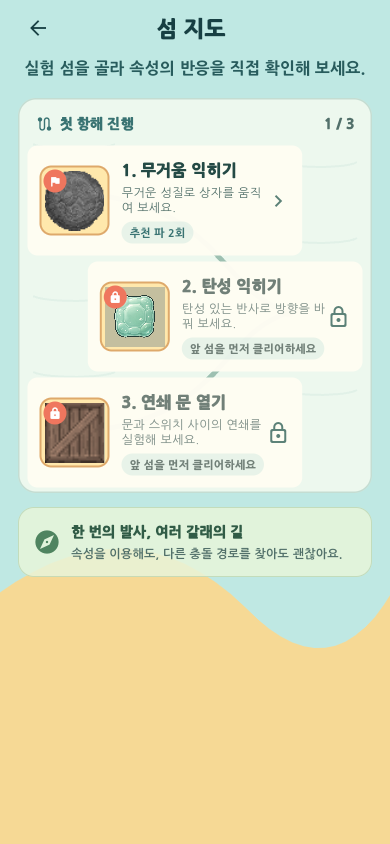

# 속성 한방(Property Shot)

## 1. 사물의 속성을 옮겨 해법을 만드는 물리 퍼즐

**속성 한방**은 주변 사물의 무거움·탄성·점착·뾰족함을 공에 옮기고, 사라진 속성과 이전 샷의 흔적까지 다음 해법으로 쓰는 세로형 물리 퍼즐이다.

| 구분 | 내용 |
|---|---|
| 핵심 선택 | 어느 사물의 속성을 공에 옮길지 결정한다. |
| 핵심 행동 | 방향과 힘을 조절해 기물의 인과 연쇄를 만든다. |
| 핵심 반전 | 빗나간 공, 열린 문, 돌아간 반사판이 다음 샷의 도구가 된다. |
| 플레이 리듬 | 관찰 → 속성 선택 → 발사 → 상태 변화 → 다음 해법 |

[[PAGE_BREAK]]

## 2. 정확히 쏘는 것보다 장면을 바꾸는 것이 중요하다

1. 홀과 장애물, 속성 원본을 읽는다.
2. 물체를 눌러 속성을 공에 옮긴다.
3. 방향과 힘을 조절해 상자·스위치·풍선·반사판을 작동시킨다.
4. 실패해도 직전 경로와 바뀐 장면을 비교해 다음 한 수를 바꾼다.
5. 공 또는 이전에 남긴 공을 홀에 넣어 완료한다.

| 속성 | 플레이 변화 | 대표 장면 |
|---|---|---|
| 무거움 | 큰 운동량으로 상자를 밀고 무게 스위치를 누른다. | 상자를 옮겨 새 길을 만들기 |
| 탄성 | 벽에 부딪혀도 탄성을 유지해 다중 반사를 만든다. | 직선을 막은 벽을 여러 번 튀겨 우회하기 |
| 점착 | 표면에 붙은 공이 다음 발사의 발판이 된다. | 첫 샷을 두 번째 샷의 기물로 쓰기 |
| 뾰족함 | 풍선을 터뜨려 숨어 있던 장치를 드러낸다. | 속성 → 풍선 → 스위치 → 문 연쇄 |

## 3. 실패해도 발견은 남고, 섬은 복구된다

각 스테이지에는 클리어와 별개의 `발견 0/3` 목표가 있다. 실제 물리 사건이 발생하면 홀에 들어가지 못해도 기록된다. 플레이어는 실패에서도 ‘이번에 알아낸 것’을 얻는다.

발견이 쌓이면 지도의 관측소·등대·다리가 폐허에서 복구 상태로 바뀐다. 복구 순간에는 시설의 큰 실루엣과 새로 열린 지원을 함께 보여 준다.

| 시설 | 조건 | 해금되는 기능 |
|---|---:|---|
| 관측소 | 발견 3개 | 실패 원인과 충돌 순서를 더 자세히 보여 준다. |
| 등대 | 발견 9개 | 각 스테이지의 L1 팁을 실패 전부터 연다. |
| 다리 | 발견 15개 | 각 런에 속성 복사 코어 1개를 보급한다. |

## 4. 10단계에서 배우고, 다른 목표로 다시 풀이한다

| 구간 | 새로 배우는 규칙 | 플레이어가 만드는 변화 |
|---|---|---|
| 1–2단계 | 무거움·탄성 | 상자를 밀고 벽 반사 경로를 만든다. |
| 3–4단계 | 스위치·문·뾰족함·풍선 | 원인과 결과의 순서를 읽는다. |
| 5–6단계 | 비워진 원본·파워 발판 | 속도와 원본 상태를 재활용한다. |
| 7–8단계 | 잔류 공·다중 연쇄 | 첫 공을 다음 성공의 조건으로 바꾼다. |
| 9–10단계 | 회전 반사판·규칙 통합 | 누적된 장면 상태로 복수 해법을 최적화한다. |

현재 빌드는 10단계 × 4패턴, 총 40개 퍼즐을 갖춘다. 발견·파·선택 도전·해법 도장으로 재도전 목표를 바꾼다. 3단계 탐사, 오늘의 도전, 4주 순환 실험은 짧은 세션으로 다시 플레이할 이유를 제공한다.

## 5. 어려움은 낮추되, 퍼즐을 푸는 즐거움은 남긴다

- 첫 1–3단계는 속성 원본과 첫 행동을 코치마크로 보여 준다.
- 홀의 첫 수용 범위를 넓혀 규칙을 이해하고도 손가락 오차로 실패하는 빈도를 줄였다.
- 첫 실패 후에는 현재 패턴의 L1 팁을 선택해 열 수 있다.
- `이번에 바꿀 것`은 실패한 샷 주변의 각도나 힘 하나만 다시 판정해 수치 없는 방향을 제안한다.
- 예상 첫 도착점·5도·힘 한 칸 조절은 선택형 도움으로 제공하고, 해당 기록은 경쟁 기록과 분리한다.
- 저모션·점멸 완화·키보드 조작·한글 의미 라벨을 제공한다.

## 6. 짧은 세션에서 발견과 해결을 즐기는 플레이어를 노린다

| 항목 | 출시 가설 |
|---|---|
| 핵심 타깃 | 짧은 시도를 반복하며 인과를 발견하는 물리·시스템 퍼즐 플레이어 |
| 세션 | 스테이지당 1–3분, 3단계 탐사 5–10분 |
| 우선 플랫폼 | 세로 조작과 햄틱에 맞춘 Android·iOS |
| 시연·유입 | Web 체험판과 PC 실행 빌드 |
| 수익 가설 | 광고·랜덤 재화 없는 체험판 + 전체 콘텐츠 1회 해금 |
| 가격 검증 범위 | 4,900–7,900원을 첫 플레이 전환율과 가격 인터뷰로 검증 |

동일 장르의 조준 퍼즐과 달리, 발사 전에 물리 속성을 편집하고 발사 후에는 장면 상태가 남는다. `성공하는 각도를 찾기`보다 `다음 샷이 유리한 장면을 만들기`를 핵심 차별점으로 삼는다.

## 7. 수직 프로토타입을 상용 제품으로 확장한다

| 시기 | 개발 목표 | 확인 방법 |
|---|---|---|
| 2026년 3분기 | 초행 플레이테스트, 1–3단계 이탈·난이도 조정 | 첫 발사 시간, 3단계 완료율, 재도전 의향 |
| 2026년 4분기 | 2번째 섬과 신규 속성, 복구 연출·사운드 폴리시 | 신규 규칙 이해도와 후반 진입률 |
| 2027년 1분기 | 4개 섬·60개 이상 스테이지, 스토어 체험판 | 보존율·크래시·저장 복구·실기기 성능 |
| 2027년 상반기 | 모바일 1차 출시와 Web 체험판 운영 | 전환율·완료율·재방문 지표 |

지원금은 레벨 추가보다 먼저 **초행 플레이테스트, 복구 연출, 통합 아트·사운드, 실기기 품질**에 투입한다. 이후 검증된 제작 규칙으로 콘텐츠를 확장한다.

## 8. 현재 빌드는 핵심 루프를 처음부터 끝까지 플레이할 수 있다

| 구분 | 현재 상태 |
|---|---|
| 콘텐츠 | 10단계·40패턴, 3단계 탐사, 오늘의 도전, 주간 실험 |
| 성취 | 발견 도감, 섬 시설 복구·성장, 해법 도장, 파·연쇄 점수 |
| 지원 | 40패턴 L1/L2, 직전 조준 비교, 실패 원인, 예상 첫 도착 |
| 반복 플레이 | 런 보상, 오늘의 도전, 탐사 계약, 리플레이 비교 |
| 플랫폼 | Web release, Android release APK, iOS 빌드 구조 |
| 안정성 | 결정론 물리, 저장 복구, 패턴 검증, 화면·접근성 회귀 |

기물을 쓰지 않는 직행이 더 쉽게 남지 않도록 40개 패턴의 성공 영역을 같은 입력 격자에서 비교한다. 이 검증은 레벨의 완전성을 보조하지만, 사용자의 재미를 대신 판정하지는 않는다. 출시 판정은 실제 초행 플레이 결과로 완성한다.
