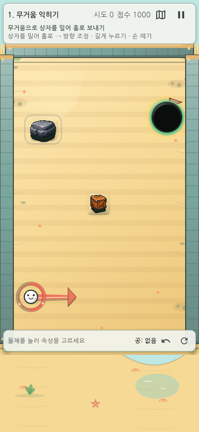
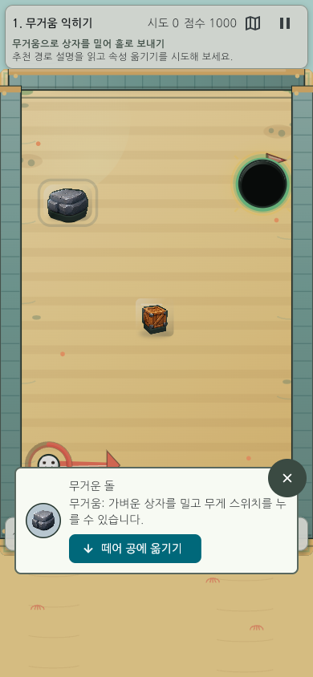
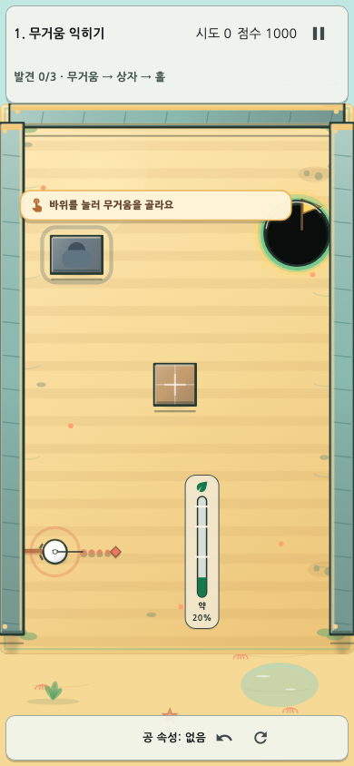
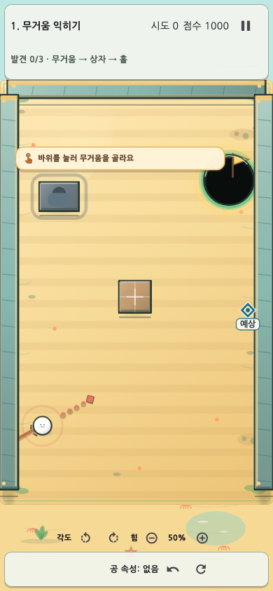
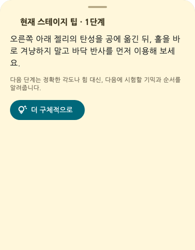
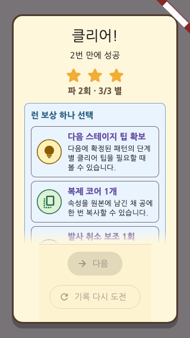

# 속성 한방(Property Shot)

## 1. 프로젝트 요약

**속성 한방**은 환경 오브젝트의 물리 속성을 공에 옮기고, 바뀐 장면과 잔류 공을 다음 해법으로 사용하는 세로형 물리 퍼즐이다. AI를 활용해 핵심 규칙, 학습 곡선, 난이도, 힌트와 보상 구조를 구체화하고 10단계 × 4패턴의 플레이 가능한 수직 프로토타입으로 발전시켰다.

| 항목 | 내용 |
|---|---|
| 역할 | AI 활용 게임 기획, 게임 디렉팅, 시스템·레벨 정책 설계, 품질 기준 결정 |
| 플랫폼 | Flutter / Flame · Web / Android |
| 범위 | 10단계·40패턴, 난이도, 힌트, 보상, 리플레이, 오늘의 도전 |
| 핵심 성과 | AI와 대화하며 아이디어를 플레이 규칙·레벨·검증 기준으로 구체화한 게임 기획 프로세스 |

## 2. 해결하려 한 문제

조준 퍼즐은 방향과 힘만 맞추면 반복적으로 느껴지기 쉽다. 반대로 기믹이 많아지면 초보자는 무엇을 해야 하는지 모른다. 이 프로젝트는 두 문제를 함께 풀었다.

- 속성을 옮겨 장면 자체를 바꾸므로 매 샷의 의미를 늘린다.
- 실패한 공과 기물 상태가 남아 시행착오가 정보와 자원이 된다.
- 쉬움 모드·구체적 L1/L2 힌트·선택형 열쇠로 정답 공개 없이 진입 장벽을 낮춘다.

## 3. 핵심 경험 설계

### 3.1 플레이 루프

관찰 → 속성 선택 → 방향·힘 결정 → 물리 연쇄 → 바뀐 상태 재사용의 순환을 만들었다.

### 3.2 실패를 자원으로 바꾸기

첫 샷이 홀에 들어가지 않아도 공이 남고 문·스위치·반사판 상태가 유지된다. 플레이어는 실패를 초기화하지 않고 다음 샷의 발판으로 바꾼다. 이는 속성 한방의 가장 중요한 차별점이다.

### 3.3 10단계 학습 설계

무거움과 탄성에서 시작해 스위치·풍선·비워진 원본·파워 발판·잔류 공·회전 반사판·속성 통합으로 확장했다. 단계별 4개 변형은 같은 규칙을 다른 공간에서 다시 적용하게 한다.

## 4. 대표 UX 개선 사례

### 4.1 손가락에 가리는 게이지

| 구분 | 내용 |
|---|---|
| 문제 | 공 주변 원형 게이지가 모바일에서 손가락에 가렸다. |
| 판단 | 발사 감각과 입력 임계값은 바꾸지 않고 표시 위치만 분리했다. |
| 결과 | 공 가까이의 부유 직선 rail이 핵심 기물과 열쇠를 피하며, 좌·우 손 선호와 저모션을 지원한다. |

### 4.2 너무 어려운 첫 경험

| 구분 | 내용 |
|---|---|
| 문제 | 첫 플레이에서 복잡한 변형이 무작위로 나올 수 있었다. |
| 판단 | 학습 구간만 완화하되 물리와 보통 기록의 공정성은 유지했다. |
| 결과 | 첫 1–4단계는 기준 패턴을 우선하고, 쉬움 모드는 실제 판정 결과의 첫 도착점만 표시한다. |

### 4.3 추상적인 도움말

| 구분 | 내용 |
|---|---|
| 문제 | ‘기믹을 활용하세요’는 실제 행동을 안내하지 못했다. |
| 판단 | 정답 숫자를 바로 공개하지 않고 행동의 구체성을 단계별로 높였다. |
| 결과 | 40패턴의 L1은 첫 행동을, L2는 위치·세기·순서·결과를 안내하며, 보상 또는 열쇠를 선택한 사람에게만 열린다. |

## 5. AI로 게임을 기획한 방식

AI를 개발 대행 도구로만 사용하지 않았다. 플레이어가 겪는 문제와 만들고 싶은 경험을 먼저 정의하고, AI가 원인과 대안을 탐색하게 한 뒤 사람이 게임의 방향을 선택했다. 선택한 기획은 기능 담당·레벨 담당·독립 검사 역할로 나눠 실행했으며, 프롬프트에는 목적, 보호해야 할 규칙, 테스트 기준, 종료 조건을 함께 적었다.

[[WORKFLOW]]

| 단계 | 내 결정 | AI의 기여 |
|---|---|---|
| 문제 정의 | 플레이어가 어디서 막히고 무엇을 느껴야 하는지 결정 | 화면·규칙·데이터에서 원인 탐색 |
| 기획 탐색 | 핵심 재미와 보호할 규칙을 확정 | 여러 해법과 부작용을 비교 |
| 구체화 | 학습 순서·난이도·힌트·보상 정책 선택 | 선택안을 레벨 데이터와 기능 계약으로 전환 |
| 검증 | 재미·공정성·접근성 기준으로 채택 여부 결정 | 독립 감사, 회귀·시각·결정론 확인 |

가장 중요한 학습은 AI가 만든 검증 지표도 틀릴 수 있다는 점이었다. 레벨 우위 계산에서 서로 다른 표본 수를 나눈 오류를 감사 에이전트가 찾아냈고, 동일 입력 격자 비교로 계약을 다시 만들었다.

## 6. 기술 구조와 검증 체계

| 계층 | 설계 의도 |
|---|---|
| 데이터 기반 StageCatalog | 40패턴을 코드 수정 없이 검증·생성 |
| 결정론 ShotResolver | 리플레이와 미리보기, 테스트가 같은 판정 사용 |
| RunState v3 | 잔류 공·보상·힌트·열쇠를 안전하게 복구 |
| Flutter + Flame | 적응형 UI와 Canvas 게임판 분리 |
| Validator + Golden | 구조·물리·접근성·화면을 자동 검사 |

### 6.1 AI가 만든 레벨을 바로 등록하지 않았다

AI가 만든 패턴은 문법상 정상이어도 홀로 가는 직선이 열려 있거나, 기물이 겹치거나, 특정 입력에서 무한 반사가 날 수 있다. 그래서 생성과 등록 사이에 `StagePatternValidator`를 두었다.

[[VALIDATOR_FLOW]]

정적 구조와 실제 물리를 통과한 뒤에도 같은 입력의 결과가 반복 실행에서 같아야 한다. 마지막으로 겹침·잘못된 참조·홀 관통·무한 반사를 일부러 넣은 invalid fixture를 사용해, 검증 도구가 오류를 실제로 잡는지도 확인했다. 이 구조는 AI가 만든 결과를 자동 채택하지 않고 **검증 가능한 후보**로 다룬다는 제작 원칙을 코드로 만든 사례다.

## 7. 결과와 품질 증거

- 10단계·40패턴 모두 플레이 가능하며 각 단계에서 기믹 사용이 우회보다 유리하다.
- 320×568 모바일부터 태블릿까지 보드·보상·게이지·SafeArea 화면을 검증했다.
- 난이도 변경·앱 재개·크래시 복구에서도 보통 기록이 오염되지 않는다.
- Web 공개 빌드와 Android release 빌드를 생성했다.

## 8. 내가 만든 가치

내가 만든 가장 큰 가치는 **AI를 활용해 게임을 기획하는 방법**이다. 아이디어 생성을 AI에 맡기는 데서 멈추지 않고, 플레이어 문제를 발견하고 대안을 비교하며 기획 결정을 실제 규칙과 검증 기준으로 연결했다.

1. ‘속성을 옮기고 실패한 공을 다시 쓴다’는 아이디어를 반복 가능한 핵심 플레이 루프로 만들었다.
2. 플레이어 피드백을 학습 순서, 쉬움·보통 난이도, L1/L2 힌트와 런 보상 정책으로 구체화했다.
3. 자연어로 전달한 기획 의도를 레벨 데이터, 상태 규칙과 측정 가능한 합격 기준으로 바꾸도록 AI를 지휘했다.
4. AI의 수치와 해법을 독립 AI가 다시 검사하게 해 오류는 반려하고, 한 명의 기획자가 시스템·레벨·UX·QA 관점을 함께 검토하는 방식을 만들었다.
